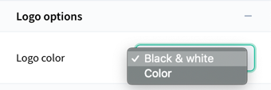
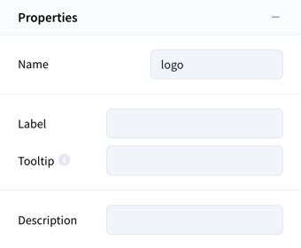

# Vueform Builder Docs

Documentation for Vueform Builder. Vueform Builder requires a separate license from Vueform - [learn more](https://vueform.com/builder).

# Requirements

- Vue.js 3.0.0+
- Tailwind CSS 3.0.0+ 

# Manual Installation

#### 1. Install Vueform in your project

Head to our [Installation guide](https://vueform.com/docs/1.x/installation#installation) and install Vueform in your project with `tailwind` theme.

#### 2. Add Vueform Builder

```bash
npm i git+https://github.com/vueform/vueform-builder-{YOUR_ID}.git
```

Vueform Builder will be provided to you via a private GitHub repo. If you're installing trial replace `{YOUR_ID}` with `trial`.

#### 3. Create `builder.config.js`

Create `builder.config.js` in your project root:

```js
// builder.config.js

export default {
  // config here
}
```

#### 4. Import `@vueform/builder`

Import `@vueform/builder` and apply it as a Vue plugin after Vueform:

```js
import Vueform from '@vueform/vueform/plugin'
import vueformConfig from './path/to/vueform.config.js'
// ...
import VueformBuilder from '@vueform/builder'
import builderConfig from './path/to/builder.config.js'
// ...

app.use(Vueform, vueformConfig)
app.use(VueformBuilder, builderConfig)
```

#### 5. Add styles

Add Vueform Builder styles to your main stylesheet:

```css
@import "@vueform/builder/index.css";
/* or */
/* @import "./path/to/node_modules/@vueform/builder/index.css"; */
```

#### 6. Update `tailwind.config.js`

Add the builder files to `content` and apply the builder's plugin:

```js
// tailwind.config.js

module.exports = {
  content: [
    // ...
    './node_modules/@vueform/builder/**/*.js',
    './node_modules/@vueform/builder/**/*.css',
  ],
  darkMode: 'class',
  // ...
  plugins: [
    // ...
    require('@vueform/builder/tailwind'),
  ]
}
```

> Make sure your Tailwind CSS is configured properly, eg. project & Vueform files are added to `content`. Vueform requires Tailwind's `preflight` so that shouldn't be disabled.

#### 7. Update `vueform.config.js`

Apply the builder's plugin to Vueform config:

```js
// vueform.config.js

// ...
import builder from '@vueform/builder/plugin'

export default {
  // ...
  plugins: [
    // ...
    builder,
  ]
}

```

#### 8. Add `<VueformBuilder>` to your app

```vue
<template>
  <div id="app" class="h-screen">
    <VueformBuilder />
  </div>
</template>
```

# Saving

To save the output of the form you can subscribe to `@save` event, which is triggered anytime the form settings are changed:

```vue
<template>
  <div id="app" class="h-screen">
    <VueformBuilder
      @save="handleSave"
    />
  </div>
</template>

<script>
  export default {
    methods: {
      handleSave(builderObject, history) {
        // builderObject - the object that should be saved to db (and loaded)
        // history - the array of previous builderObjects
      },
    }
  }
</script>
```

The `@save` event has two params:
- **builderObject** `{object}` <br> the object that should be saved to db (and can be loaded)
- **history** `{array}` <br> he array of previous builderObjects

The history object only contains the last `n` elements which is possible to store given the local storage limit of 5 MB in most cases (enough for about 100 records for an average form).

## Manual Saving

The current state of the form is always available in local storage as `vueform-builder` and `vueform-history`.

To save the form anytime just reach for these values:

```js
const builderObject = localStorage.getItem('vueform-builder')
const history = localStorage.getItem('vueform-history')
```

# Loading

Once a form's JSON (& history) are saved into the database they can be loaded back using Vueform Builder's `.load()` method:

```vue
<template>
  <div id="app" class="h-screen">
    <VueformBuilder
      ref="builder$"
    />
  </div>
</template>

<script>
  import axios from 'axios'

  export default {
    async onMounted() {
      const form = (await axios.get('/url')).data

      let builderObject = form.builder // object
      let history = form.history // array

      this.$refs.builder$.load(builderObject, history)
    }
  }
</script>
```

# Configuration

Vueform Builder can be configured via `builder.config.js`:

```js
// builder.config.js

export default {
  // config options
}
```

## Settings

The following options are for configuring different aspects of the builder's layout.

```js
// builder.config.js

export default {
  storagePrefix: null, // prefixes localStorage keys
  delay: 300, // the ms to wait between last text input and preview rerender, `false` turns it off (not recommended)
  autosave: 1000, // the ms to wait between last change and saving data to local storage & triggering `@save` event
  history: true, // whether it should store history
  maxHistory: -1, // the maximum number of history items to store, `-1` for unlimited
  longFieldNames: false, // whether conditional field names should be full path or name only
}
```

## Layout

The following options are for configuring different aspects of the builder's layout.

```js
// builder.config.js

export default {
  search: true,
  views: ['editor', 'preview', 'code'],
  devices: ['tablet', 'desktop'], // set to `false` to hide device selector and disable responsive column resizing
  breakpoints: {
    tablet: {
      breakpoint: 'sm',
      viewportSize: 640, // used only to inform users about the viewport size related to `tablet` view
    },
    desktop: {
      breakpoint: 'lg',
      viewportSize: 1024, // used only to inform users about the viewport size related to `desktop` view
    },
  }, // the breakpoints tied to devices
  darkMode: ['light', 'dark'],
  toggleLeft: true,
  toggleRight: true,
  clear: true,
  save: true,
  undo: true,
  modelPreview: true,
  leftPanel: ['elements', 'tree'],
  rightPanel: ['form', 'theme', 'export', 'settings', 'model'],
  defaultWidth: 432,
}
```

#### Changing Device Breakpoints

Vueform is using a mobile-first breakpoint system when it comes to resizing columns on different devices and viewport sizes. The default breakpoints are based on Tailwind CSS: https://tailwindcss.com/docs/responsive-design

By default the `tablet` breakpoint will use `sm` and `desktop` will use `lg`, which means that column sizing made under `tablet` view will have effect on `sm` breakpoint and up and the same is true for `desktop` with `lg`. If you want to change these to eg. `tablet` -> `md` first you need to update the `breakpoints.tablet.breakpoint` to `md` in the config. Second you need to include the `scss` version of Vueform Builder's styles and set `$vfb-tablet-breakpoint` to `md` as well. Here's an example:

```css
/* Your original CSS import */

@import "@vueform/builder/index.css";
```

Replace it with the following in a file where you can import `scss` and make sure you have an scss loader:

```scss
/* Using SCSS import instead of CSS with a custom variable */

$vfb-tablet-breakpoint: 'md';

@import "@vueform/builder/scss/index.scss";
```

If you want to change the breakpoint related to `desktop`, you can use `$vfb-desktop-breakpoint` variable.

## Elements

The following options configure the available elements & element categories.

```js
// builder.config.js

export default {
  // Element categories (set to `false` to hide)
  categories: [
    {
      label: 'Fields',
      key: 'fields',
    },
    {
      label: 'Static',
      key: 'static',
    },
    {
      label: 'Structure',
      key: 'structure',
    },
  ],

  // List of element types to include
  elements: [
    'text',
    'number',
    'email',
    'phone',
    'password',
    'url',
    'location',
    'textarea',
    'editor',
    'checkbox',
    'checkboxgroup',
    'checkboxBlocks',
    'checkboxTabs',
    'radio',
    'radiogroup',
    'radioBlocks',
    'radioTabs',
    'toggle',
    'select',
    'multiselect',
    'tags',
    'date',
    'datetime',
    'time',
    'dates',
    'dateRange',
    'slider',
    'rangeSlider',
    'verticalSlider',
    'file',
    'multifile',
    'image',
    'multiImage',
    'gallery',
    'hidden',
    'submit',
    'reset',
    'primaryButton',
    'secondaryButton',
    'dangerButton',
    'h1',
    'h2',
    'h3',
    'h4',
    'p',
    'quote',
    'img',
    'link',
    'divider',
    'html',
    'tabs',
    'steps',
    'container',
    'container2',
    'container3',
    'container4',
    'list',
    'nestedList',
  ],

  // List of element types to exclude
  excludeElements: [],
}
```

## Form settings panel

The following options can be used to disable form settings config options.

```js
// builder.config.js

export default {
  form: {
    props: {
      properties: {
        name: true,
        width: true,
        nesting: true,
      },
      submission: {
        endpoint: true,
        formKey: true,
      },
      validation: {
        live: true,
      },
      layout: {
        size: {
          sm: true,
          md: true,
          lg: true,
        },
        columns: {
          container: true,
          label: true,
          wrapper: true,
        },
        forceLabels: true,
        floatPlaceholders: true,
        displayErrors: true,
        displayMessages: true,
      },
    },
  },
}
```

## Theme settings panel

The following options can be used to disable theme config options.

```js
// builder.config.js

export default {
  theme: {
    props: {
      theme: {
        theme: true,
      },
      tools: {
        tools: true,
      },
      colors: {
        primary: true,
        'primary-darker': true,
        'color-on-primary': true,
        danger: true,
        'danger-lighter': true,
        success: true,
        'success-lighter': true,
        'gray-50': true,
        'gray-100': true,
        'gray-200': true,
        'gray-300': true,
        'gray-400': true,
        'gray-500': true,
        'gray-600': true,
        'gray-700': true,
        'gray-800': true,
        'gray-900': true,
      },
      fonts: {
        'font-size': true,
        'line-height': true,
        'letter-spacing': true,
        'font-size-small': true,
        'line-height-small': true,
        'letter-spacing-small': true,
      },
      spaces: {
        gutter: true,
        'color-muted': true,
        'color-passive': true,
        'bg-passive': true,
        'border-color-passive': true,
        'bg-selected': true,
        'radius-small': true,
        'shadow-handles': true,
        'shadow-handles-hover': true,
        'shadow-handles-focus': true,
      },
      inputs: {
        'min-height-input': true,
        'ring-width': true,
        'ring-color': true,
        'py-input': true,
        'px-input': true,
        'border-width-input': true,
        'radius-input': true,
        'radius-large': true,
        'border-color-input': true,
        'color-input': true,
        'bg-icon': true,
        'color-floating': true,
        'bg-input': true,
        'shadow-input': true,
        hover: true,
        'color-input-hover': true,
        'bg-input-hover': true,
        'border-color-input-hover': true,
        'shadow-input-hover': true,
        focus: true,
        'color-input-focus': true,
        'color-floating-focus': true,
        'bg-input-focus': true,
        'border-color-input-focus': true,
        'shadow-input-focus': true,
        danger: true,
        'color-input-danger': true,
        'color-floating-danger': true,
        'bg-input-danger': true,
        'border-color-input-danger': true,
        success: true,
        'color-input-success': true,
        'color-floating-success': true,
        'bg-input-success': true,
        'border-color-input-success': true,
        disabled: true,
        'color-disabled': true,
        'bg-disabled': true,
        'floating-top': true,
        'space-addon': true,
        'bg-addon': true,
        'color-addon': true,
      },
      select: {
        dropdown: true,
        'border-width-dropdown': true,
        'shadow-dropdown': true,
      },
      tags: {
        'py-tag': true,
        'px-tag': true,
        'space-tags': true,
        'border-width-tag': true,
        'radius-tag': true,
        'color-tag': true,
        'bg-tag': true,
        'border-color-tag': true,
      },
      datepicker: {
        'color-date-head': true,
        'bg-date-head': true,
      },
      checkboxes: {
        'checkbox-size': true,
        'space-checkbox': true,
        'border-color-checked': true,
        radio: true,
        'border-width-radio': true,
        checkbox: true,
        'border-width-checkbox': true,
        'radius-checkbox': true,
        tabs: true,
        'py-group-tabs': true,
        'px-group-tabs': true,
        blocks: true,
        'py-group-blocks': true,
        'px-group-blocks': true,
      },
      slider: {
        'slider-height': true,
        'slider-height-vertical': true,
        'radius-slider': true,
        handle: true,
        'slider-handle-size': true,
        'bg-slider-handle': true,
        tooltip: true,
        'py-slider-tooltip': true,
        'px-slider-tooltip': true,
        'slider-tooltip-distance': true,
        'slider-tooltip-arrow-size': true,
        'border-color-slider-tooltip': true,
      },
      toggle: {
        'toggle-width': true,
        'toggle-height': true,
        'border-width-toggle': true,
        handle: true,
        'bg-toggle-handle': true,
      },
      images: {
        image: true,
        'radius-image': true,
        gallery: true,
        'gallery-size': true,
        'radius-gallery': true,
      },
      buttons: {
        'py-btn': true,
        'px-btn': true,
        'small-buttons': true,
        'py-btn-small': true,
        'px-btn-small': true,
        'border-color-btn': true,
        'border-width-btn': true,
        'radius-btn': true,
        'color-btn': true,
        'bg-btn': true,
        'shadow-btn': true,
        secondary: true,
        'color-btn-secondary': true,
        'bg-btn-secondary': true,
        'border-color-btn-secondary': true,
        danger: true,
        'color-btn-danger': true,
        'bg-btn-danger': true,
        'border-color-btn-danger': true,
      },
    },
  },
}
```

## Export settings panel

The following options can be used to disable export config options.

```js
// builder.config.js

export default {
  export: {
    props: {
      export: {
        output: true,
        api: true,
        theme: true,
        download: true,
      },
    },
  },
}
```

## Element settings panel

Element settings can be disabled for different elements under `element.props`. This object has an item for each element type and a special one, called `default`.

```js
// builder.config.js

export default {
  element: {
    props: {
      // Disables placeholder options for each element
      default: {
        properties: {
          placeholder: false,
        },
        decorators: {
          addons: false,
          before: false,
          between: false,
          after: false,
          tooltip: false,
          description: false,
        },
        // ...
      },

      // ...
    },
  },
}
```

The `default` contains all the options of all the elements and can be used to disable properties globally, without having to go through each element and eg. disabling conditions for each.

When disabling `default` options you have to explicitly disable options and **you can't disable option groups**:

```js
// builder.config.js

export default {
  element: {
    props: {

      // THIS WILL NOT WORK
      default: {
        properties: false
      },

      // THIS WILL WORK
      default: {
        properties: {
          inputType: false,
          label: false,
          tooltip: false,
          placeholder: false,
          description: false,
          meta: false,
        }
      },
    },
  },
}
```

The named element sections (eg. `text`, `textarea` or `select`, etc.) contain configuration options for only that specific element. These can be used to disable config options for certain elements only and to override `default`.

```js
// builder.config.js

export default {
  element: {
    props: {
      // Disables placeholder options for all elements
      default: {
        properties: {
          placeholder: false,
        },
        // ...
      },

      // Enables back placeholder options for `select` only
      select: {
        properties: {
          placeholder: true,
        },
        // ...
      },

      // ...
    },
  },
}
```

The only config you shouldn't disable ever is the `properties.type`. This is a core field that needs to be included in each element config panels.

We can disable options groups or single options for elements:

```js
// builder.config.js

export default {
  element: {
    props: {

      // THIS WILL WORK
      text: {
        properties: false
      },

      // THIS WILL ALSO WORK
      text: {
        properties: {
          inputType: false,
          label: false,
          tooltip: false,
          placeholder: false,
          description: false,
        }
      },
    },
  },
}
```

Certain configuration options are broken down further into "sub-options", enabling to turn off features within configuration groups, eg. `validation`:

```js
// builder.config.js

export default {
  element: {
    props: {
      default: {
        validation: {
          // Turn off validation feature
          // completely for each element
          validation: false,

          // Turn off only "min", "max" and
          // "size" validation rules for each
          // element that have them
          validation: {
            min: false,
            max: false,
            size: false,
            // ...
          },
        }
      },
      // ...
    },
  },
}
```

Here's the complete config for element props:

```js
// builder.config.js

export default {
  element: {
    props: {
      default: {
        properties: {
          type: true,
          name: true,
          inputType: true,
          label: true,
          tooltip: true,
          placeholder: {
            floating: true,
          },
          description: true,
          meta: true,
        },
        data: {
          default: true,
          submit: true,
          items: {
            list: true,
            json: true,
            endpoint: true,
          },
          object: true,
          nested: true,
        },
        decorators: {
          addons: {
            prefix: true,
            suffix: true,
          },
          before: true,
          between: true,
          after: true,
          tooltip: true,
          description: true,
        },
        layout: {
          size: {
            sm: true,
            md: true,
            lg: true,
          },
          columns: {
            container: true,
            label: true,
            wrapper: true,
          },
          view: {
            tabs: true,
            blocks: true,
          },
        },
        validation: {
          fieldName: true,
          validation: {
            accepted: true,
            active_url: true,
            after: true,
            after_or_equal: true,
            alpha: true,
            alpha_dash: true,
            alpha_num: true,
            array: true,
            before: true,
            before_or_equal: true,
            boolean: true,
            date: true,
            date_equals: true,
            date_format: true,
            different: true,
            digits: true,
            digits_between: true,
            dimensions: true,
            width: true,
            height: true,
            minWidth: true,
            minHeight: true,
            maxWidth: true,
            maxHeight: true,
            ratio: true,
            distinct: true,
            email: true,
            exists: true,
            file: true,
            gt: true,
            gte: true,
            image: true,
            in: true,
            in_array: true,
            integer: true,
            ip: true,
            ipv4: true,
            ipv6: true,
            json: true,
            lt: true,
            lte: true,
            max: true,
            mimetypes: true,
            mimes: true,
            min: true,
            not_in: true,
            nullable: true,
            numeric: true,
            regex: true,
            required: true,
            same: true,
            size: true,
            string: true,
            timezone: true,
            unique: true,
            url: true,
            uuid: true,
          },
          fileRules: {
            min: true,
            max: true,
            mimes: true,
            extensions: true,
            dimensions: true,
            width: true,
            height: true,
            minWidth: true,
            minHeight: true,
            maxWidth: true,
            maxHeight: true,
            ratio: true,
          },
        },
        conditions: {
          conditions: true,
        },
        attributes: {
          disabled: true,
          readonly: true,
          id: true,
          autocomplete: true,
          attrs: true,
        },
        options: {
          autogrow: true,
          rows: true,
          endpoint: {
            method: true,
          },
          accept: {
            mimes: true,
            extensions: true,
          },
          tools: true,
          text: true,
          boolValue: true,
          radio: true,
          labels: true,
          native: true,
          search: {
            strict: true,
            trackBy: true,
            inputType: true,
            autocomplete: true,
          },
          create: {
            append: true,
            addOn: true,
          },
          behavior: {
            deselect: true,
            clear: true,
            closeOnSelect: true,
          },
          ui: {
            caret: true,
            truncate: true,
            openDirection: true,
            limit: true,
          },
          noOptions: true,
          noResults: true,
          max: true,
          multipleLabel: true,
          format: {
            display: true,
            value: true,
            load: true,
          },
          restrictions: {
            min: true,
            max: true,
            disables: true,
          },
          hour24: true,
          seconds: true,
          mode: true,
          min: true,
          step: true,
          orientation: true,
          direction: true,
          tooltips: {
            merge: true,
            show: true,
            position: true,
          },
          tooltipFormat: true,
          autoUpload: true,
          dragAndDrop: true,
          softRemove: true,
          clickable: true,
          urls: {
            click: true,
            preview: true,
          },
          endpoints: {
            uploadTemp: true,
            uploadTempMethod: true,
            removeTemp: true,
            removeTempMethod: true,
            remove: true,
            removeMethod: true,
          },
          params: true,
          controls: {
            add: true,
            remove: true,
            sort: true,
          },
          store: {
            object: true,
            file: true,
            order: true,
          },
          buttonLabel: true,
          buttonType: true,
          submits: true,
          resets: true,
          href: true,
          target: true,
          content: true,
          initial: true,
          addText: true,
          storeOrder: true,
        },
      },
      text: {
        properties: {
          type: true,
          name: true,
          inputType: true,
          label: true,
          tooltip: true,
          placeholder: {
            floating: true,
          },
          description: true,
        },
        data: {
          default: true,
          submit: true,
        },
        decorators: {
          addons: {
            prefix: true,
            suffix: true,
          },
          before: true,
          between: true,
          after: true,
        },
        layout: {
          size: {
            sm: true,
            md: true,
            lg: true,
          },
          columns: {
            container: true,
            label: true,
            wrapper: true,
          },
        },
        validation: {
          fieldName: true,
          validation: {
            active_url: true,
            after: true,
            after_or_equal: true,
            alpha: true,
            alpha_dash: true,
            alpha_num: true,
            before: true,
            before_or_equal: true,
            date: true,
            date_equals: true,
            date_format: true,
            different: true,
            digits: true,
            digits_between: true,
            email: true,
            exists: true,
            gt: true,
            gte: true,
            in: true,
            in_array: true,
            integer: true,
            ip: true,
            ipv4: true,
            ipv6: true,
            json: true,
            lt: true,
            lte: true,
            max: true,
            min: true,
            not_in: true,
            nullable: true,
            numeric: true,
            regex: true,
            required: true,
            same: true,
            size: true,
            string: true,
            timezone: true,
            unique: true,
            url: true,
            uuid: true,
          },
        },
        conditions: {
          conditions: true,
        },
        attributes: {
          disabled: true,
          readonly: true,
          id: true,
          autocomplete: true,
          attrs: true,
        },
      },
      number: {
        properties: {
          type: true,
          name: true,
          inputType: true,
          label: true,
          tooltip: true,
          placeholder: {
            floating: true,
          },
          description: true,
        },
        data: {
          default: true,
          submit: true,
        },
        decorators: {
          addons: {
            prefix: true,
            suffix: true,
          },
          before: true,
          between: true,
          after: true,
        },
        layout: {
          size: {
            sm: true,
            md: true,
            lg: true,
          },
          columns: {
            container: true,
            label: true,
            wrapper: true,
          },
        },
        validation: {
          fieldName: true,
          validation: {
            active_url: true,
            after: true,
            after_or_equal: true,
            alpha: true,
            alpha_dash: true,
            alpha_num: true,
            before: true,
            before_or_equal: true,
            date: true,
            date_equals: true,
            date_format: true,
            different: true,
            digits: true,
            digits_between: true,
            email: true,
            exists: true,
            gt: true,
            gte: true,
            in: true,
            in_array: true,
            integer: true,
            ip: true,
            ipv4: true,
            ipv6: true,
            json: true,
            lt: true,
            lte: true,
            max: true,
            min: true,
            not_in: true,
            nullable: true,
            numeric: true,
            regex: true,
            required: true,
            same: true,
            size: true,
            string: true,
            timezone: true,
            unique: true,
            url: true,
            uuid: true,
          },
        },
        conditions: {
          conditions: true,
        },
        attributes: {
          disabled: true,
          readonly: true,
          id: true,
          autocomplete: true,
          attrs: true,
        },
      },
      email: {
        properties: {
          type: true,
          name: true,
          inputType: true,
          label: true,
          tooltip: true,
          placeholder: {
            floating: true,
          },
          description: true,
        },
        data: {
          default: true,
          submit: true,
        },
        decorators: {
          addons: {
            prefix: true,
            suffix: true,
          },
          before: true,
          between: true,
          after: true,
        },
        layout: {
          size: {
            sm: true,
            md: true,
            lg: true,
          },
          columns: {
            container: true,
            label: true,
            wrapper: true,
          },
        },
        validation: {
          fieldName: true,
          validation: {
            active_url: true,
            after: true,
            after_or_equal: true,
            alpha: true,
            alpha_dash: true,
            alpha_num: true,
            before: true,
            before_or_equal: true,
            date: true,
            date_equals: true,
            date_format: true,
            different: true,
            digits: true,
            digits_between: true,
            email: true,
            exists: true,
            gt: true,
            gte: true,
            in: true,
            in_array: true,
            integer: true,
            ip: true,
            ipv4: true,
            ipv6: true,
            json: true,
            lt: true,
            lte: true,
            max: true,
            min: true,
            not_in: true,
            nullable: true,
            numeric: true,
            regex: true,
            required: true,
            same: true,
            size: true,
            string: true,
            timezone: true,
            unique: true,
            url: true,
            uuid: true,
          },
        },
        conditions: {
          conditions: true,
        },
        attributes: {
          disabled: true,
          readonly: true,
          id: true,
          autocomplete: true,
          attrs: true,
        },
      },
      phone: {
        properties: {
          type: true,
          name: true,
          inputType: true,
          label: true,
          tooltip: true,
          placeholder: {
            floating: true,
          },
          description: true,
        },
        data: {
          default: true,
          submit: true,
        },
        decorators: {
          addons: {
            prefix: true,
            suffix: true,
          },
          before: true,
          between: true,
          after: true,
        },
        layout: {
          size: {
            sm: true,
            md: true,
            lg: true,
          },
          columns: {
            container: true,
            label: true,
            wrapper: true,
          },
        },
        validation: {
          fieldName: true,
          validation: {
            active_url: true,
            after: true,
            after_or_equal: true,
            alpha: true,
            alpha_dash: true,
            alpha_num: true,
            before: true,
            before_or_equal: true,
            date: true,
            date_equals: true,
            date_format: true,
            different: true,
            digits: true,
            digits_between: true,
            email: true,
            exists: true,
            gt: true,
            gte: true,
            in: true,
            in_array: true,
            integer: true,
            ip: true,
            ipv4: true,
            ipv6: true,
            json: true,
            lt: true,
            lte: true,
            max: true,
            min: true,
            not_in: true,
            nullable: true,
            numeric: true,
            regex: true,
            required: true,
            same: true,
            size: true,
            string: true,
            timezone: true,
            unique: true,
            url: true,
            uuid: true,
          },
        },
        conditions: {
          conditions: true,
        },
        attributes: {
          disabled: true,
          readonly: true,
          id: true,
          autocomplete: true,
          attrs: true,
        },
      },
      password: {
        properties: {
          type: true,
          name: true,
          inputType: true,
          label: true,
          tooltip: true,
          placeholder: {
            floating: true,
          },
          description: true,
        },
        data: {
          default: true,
          submit: true,
        },
        decorators: {
          addons: {
            prefix: true,
            suffix: true,
          },
          before: true,
          between: true,
          after: true,
        },
        layout: {
          size: {
            sm: true,
            md: true,
            lg: true,
          },
          columns: {
            container: true,
            label: true,
            wrapper: true,
          },
        },
        validation: {
          fieldName: true,
          validation: {
            active_url: true,
            after: true,
            after_or_equal: true,
            alpha: true,
            alpha_dash: true,
            alpha_num: true,
            before: true,
            before_or_equal: true,
            date: true,
            date_equals: true,
            date_format: true,
            different: true,
            digits: true,
            digits_between: true,
            email: true,
            exists: true,
            gt: true,
            gte: true,
            in: true,
            in_array: true,
            integer: true,
            ip: true,
            ipv4: true,
            ipv6: true,
            json: true,
            lt: true,
            lte: true,
            max: true,
            min: true,
            not_in: true,
            nullable: true,
            numeric: true,
            regex: true,
            required: true,
            same: true,
            size: true,
            string: true,
            timezone: true,
            unique: true,
            url: true,
            uuid: true,
          },
        },
        conditions: {
          conditions: true,
        },
        attributes: {
          disabled: true,
          readonly: true,
          id: true,
          autocomplete: true,
          attrs: true,
        },
      },
      url: {
        properties: {
          type: true,
          name: true,
          inputType: true,
          label: true,
          tooltip: true,
          placeholder: {
            floating: true,
          },
          description: true,
        },
        data: {
          default: true,
          submit: true,
        },
        decorators: {
          addons: {
            prefix: true,
            suffix: true,
          },
          before: true,
          between: true,
          after: true,
        },
        layout: {
          size: {
            sm: true,
            md: true,
            lg: true,
          },
          columns: {
            container: true,
            label: true,
            wrapper: true,
          },
        },
        validation: {
          fieldName: true,
          validation: {
            active_url: true,
            after: true,
            after_or_equal: true,
            alpha: true,
            alpha_dash: true,
            alpha_num: true,
            before: true,
            before_or_equal: true,
            date: true,
            date_equals: true,
            date_format: true,
            different: true,
            digits: true,
            digits_between: true,
            email: true,
            exists: true,
            gt: true,
            gte: true,
            in: true,
            in_array: true,
            integer: true,
            ip: true,
            ipv4: true,
            ipv6: true,
            json: true,
            lt: true,
            lte: true,
            max: true,
            min: true,
            not_in: true,
            nullable: true,
            numeric: true,
            regex: true,
            required: true,
            same: true,
            size: true,
            string: true,
            timezone: true,
            unique: true,
            url: true,
            uuid: true,
          },
        },
        conditions: {
          conditions: true,
        },
        attributes: {
          disabled: true,
          readonly: true,
          id: true,
          autocomplete: true,
          attrs: true,
        },
      },
      location: {
        properties: {
          type: true,
          name: true,
          inputType: true,
          label: true,
          tooltip: true,
          placeholder: {
            floating: true,
          },
          description: true,
        },
        data: {
          default: true,
          submit: true,
        },
        decorators: {
          addons: {
            prefix: true,
            suffix: true,
          },
          before: true,
          between: true,
          after: true,
        },
        layout: {
          size: {
            sm: true,
            md: true,
            lg: true,
          },
          columns: {
            container: true,
            label: true,
            wrapper: true,
          },
        },
        validation: {
          fieldName: true,
          validation: {
            required: true,
          },
        },
        conditions: {
          conditions: true,
        },
        attributes: {
          disabled: true,
          readonly: true,
          id: true,
          autocomplete: true,
          attrs: true,
        },
      },
      textarea: {
        properties: {
          type: true,
          name: true,
          label: true,
          tooltip: true,
          placeholder: {
            floating: true,
          },
          description: true,
        },
        options: {
          autogrow: true,
          rows: true,
        },
        data: {
          default: true,
          submit: true,
        },
        decorators: {
          addons: {
            prefix: true,
            suffix: true,
          },
          before: true,
          between: true,
          after: true,
        },
        layout: {
          size: {
            sm: true,
            md: true,
            lg: true,
          },
          columns: {
            container: true,
            label: true,
            wrapper: true,
          },
        },
        validation: {
          fieldName: true,
          validation: {
            alpha: true,
            alpha_dash: true,
            alpha_num: true,
            different: true,
            digits: true,
            digits_between: true,
            email: true,
            exists: true,
            gt: true,
            gte: true,
            in: true,
            in_array: true,
            integer: true,
            ip: true,
            ipv6: true,
            json: true,
            lt: true,
            lte: true,
            max: true,
            min: true,
            not_in: true,
            nullable: true,
            numeric: true,
            regex: true,
            required: true,
            same: true,
            size: true,
            string: true,
            timezone: true,
            unique: true,
            url: true,
            uuid: true,
          },
        },
        conditions: {
          conditions: true,
        },
        attributes: {
          disabled: true,
          readonly: true,
          id: true,
          attrs: true,
        },
      },
      editor: {
        properties: {
          type: true,
          name: true,
          label: true,
          tooltip: true,
          placeholder: {
            floating: true,
          },
          description: true,
        },
        options: {
          endpoint: {
            method: true,
          },
          accept: {
            mimes: true,
            extensions: true,
          },
          tools: true,
        },
        data: {
          default: true,
          submit: true,
        },
        decorators: {
          before: true,
          between: true,
          after: true,
        },
        layout: {
          size: {
            sm: true,
            md: true,
            lg: true,
          },
          columns: {
            container: true,
            label: true,
            wrapper: true,
          },
        },
        validation: {
          fieldName: true,
          validation: {
            different: true,
            gt: true,
            gte: true,
            lt: true,
            lte: true,
            max: true,
            min: true,
            nullable: true,
            regex: true,
            required: true,
            same: true,
            size: true,
            string: true,
          },
        },
        conditions: {
          conditions: true,
        },
        attributes: {
          disabled: true,
          id: true,
        },
      },
      checkbox: {
        properties: {
          type: true,
          name: true,
          label: true,
          tooltip: true,
          description: true,
        },
        options: {
          text: true,
          boolValue: true,
        },
        data: {
          default: true,
          submit: true,
        },
        decorators: {
          before: true,
          between: true,
          after: true,
        },
        layout: {
          size: {
            sm: true,
            md: true,
            lg: true,
          },
          columns: {
            container: true,
            label: true,
            wrapper: true,
          },
        },
        validation: {
          fieldName: true,
          validation: {
            accepted: true,
            different: true,
            in: true,
            not_in: true,
            same: true,
          },
        },
        conditions: {
          conditions: true,
        },
        attributes: {
          disabled: true,
          id: true,
        },
      },
      checkboxgroup: {
        properties: {
          type: true,
          name: true,
          label: true,
          tooltip: true,
          description: true,
        },
        data: {
          items: {
            list: true,
            json: true,
            endpoint: true,
          },
          default: true,
          submit: true,
        },
        decorators: {
          before: true,
          between: true,
          after: true,
        },
        layout: {
          view: {
            tabs: true,
            blocks: true,
          },
          size: {
            sm: true,
            md: true,
            lg: true,
          },
          columns: {
            container: true,
            label: true,
            wrapper: true,
          },
        },
        validation: {
          fieldName: true,
          validation: {
            array: true,
            distinct: true,
            max: true,
            min: true,
            nullable: true,
            required: true,
            size: true,
          },
        },
        conditions: {
          conditions: true,
        },
        attributes: {
          disabled: true,
          id: true,
        },
      },
      checkboxBlocks: {
        properties: {
          type: true,
          name: true,
          label: true,
          tooltip: true,
          description: true,
        },
        data: {
          items: {
            list: true,
            json: true,
            endpoint: true,
          },
          default: true,
          submit: true,
        },
        decorators: {
          before: true,
          between: true,
          after: true,
        },
        layout: {
          view: {
            tabs: true,
            blocks: true,
          },
          size: {
            sm: true,
            md: true,
            lg: true,
          },
          columns: {
            container: true,
            label: true,
            wrapper: true,
          },
        },
        validation: {
          fieldName: true,
          validation: {
            array: true,
            distinct: true,
            max: true,
            min: true,
            nullable: true,
            required: true,
            size: true,
          },
        },
        conditions: {
          conditions: true,
        },
        attributes: {
          disabled: true,
          id: true,
        },
      },
      checkboxTabs: {
        properties: {
          type: true,
          name: true,
          label: true,
          tooltip: true,
          description: true,
        },
        data: {
          items: {
            list: true,
            json: true,
            endpoint: true,
          },
          default: true,
          submit: true,
        },
        decorators: {
          before: true,
          between: true,
          after: true,
        },
        layout: {
          view: {
            tabs: true,
            blocks: true,
          },
          size: {
            sm: true,
            md: true,
            lg: true,
          },
          columns: {
            container: true,
            label: true,
            wrapper: true,
          },
        },
        validation: {
          fieldName: true,
          validation: {
            array: true,
            distinct: true,
            max: true,
            min: true,
            nullable: true,
            required: true,
            size: true,
          },
        },
        conditions: {
          conditions: true,
        },
        attributes: {
          disabled: true,
          id: true,
        },
      },
      radio: {
        properties: {
          type: true,
          name: true,
          label: true,
          tooltip: true,
          description: true,
        },
        options: {
          text: true,
          radio: true,
        },
        data: {
          default: true,
          submit: true,
        },
        decorators: {
          before: true,
          between: true,
          after: true,
        },
        layout: {
          size: {
            sm: true,
            md: true,
            lg: true,
          },
          columns: {
            container: true,
            label: true,
            wrapper: true,
          },
        },
        validation: {
          fieldName: true,
          validation: {
            boolean: true,
            in: true,
            in_array: true,
            not_in: true,
            required: true,
          },
        },
        conditions: {
          conditions: true,
        },
        attributes: {
          disabled: true,
          id: true,
        },
      },
      radiogroup: {
        properties: {
          type: true,
          name: true,
          label: true,
          tooltip: true,
          description: true,
        },
        data: {
          items: {
            list: true,
            json: true,
            endpoint: true,
          },
          default: true,
          submit: true,
        },
        decorators: {
          before: true,
          between: true,
          after: true,
        },
        layout: {
          view: {
            tabs: true,
            blocks: true,
          },
          size: {
            sm: true,
            md: true,
            lg: true,
          },
          columns: {
            container: true,
            label: true,
            wrapper: true,
          },
        },
        validation: {
          fieldName: true,
          validation: {
            different: true,
            in: true,
            in_array: true,
            not_in: true,
            nullable: true,
            required: true,
            same: true,
          },
        },
        conditions: {
          conditions: true,
        },
        attributes: {
          disabled: true,
          id: true,
        },
      },
      radioBlocks: {
        properties: {
          type: true,
          name: true,
          label: true,
          tooltip: true,
          description: true,
        },
        data: {
          items: {
            list: true,
            json: true,
            endpoint: true,
          },
          default: true,
          submit: true,
        },
        decorators: {
          before: true,
          between: true,
          after: true,
        },
        layout: {
          view: {
            tabs: true,
            blocks: true,
          },
          size: {
            sm: true,
            md: true,
            lg: true,
          },
          columns: {
            container: true,
            label: true,
            wrapper: true,
          },
        },
        validation: {
          fieldName: true,
          validation: {
            different: true,
            in: true,
            in_array: true,
            not_in: true,
            nullable: true,
            required: true,
            same: true,
          },
        },
        conditions: {
          conditions: true,
        },
        attributes: {
          disabled: true,
          id: true,
        },
      },
      radioTabs: {
        properties: {
          type: true,
          name: true,
          label: true,
          tooltip: true,
          description: true,
        },
        data: {
          items: {
            list: true,
            json: true,
            endpoint: true,
          },
          default: true,
          submit: true,
        },
        decorators: {
          before: true,
          between: true,
          after: true,
        },
        layout: {
          view: {
            tabs: true,
            blocks: true,
          },
          size: {
            sm: true,
            md: true,
            lg: true,
          },
          columns: {
            container: true,
            label: true,
            wrapper: true,
          },
        },
        validation: {
          fieldName: true,
          validation: {
            different: true,
            in: true,
            in_array: true,
            not_in: true,
            nullable: true,
            required: true,
            same: true,
          },
        },
        conditions: {
          conditions: true,
        },
        attributes: {
          disabled: true,
          id: true,
        },
      },
      toggle: {
        properties: {
          type: true,
          name: true,
          label: true,
          tooltip: true,
          description: true,
        },
        options: {
          text: true,
          labels: true,
          boolValue: true,
        },
        data: {
          default: true,
          submit: true,
        },
        decorators: {
          before: true,
          between: true,
          after: true,
        },
        layout: {
          size: {
            sm: true,
            md: true,
            lg: true,
          },
          columns: {
            container: true,
            label: true,
            wrapper: true,
          },
        },
        validation: {
          fieldName: true,
          validation: {
            different: true,
            in: true,
            not_in: true,
            nullable: true,
            required: true,
            same: true,
          },
        },
        conditions: {
          conditions: true,
        },
        attributes: {
          disabled: true,
          id: true,
        },
      },
      select: {
        properties: {
          type: true,
          name: true,
          label: true,
          tooltip: true,
          placeholder: {
            floating: true,
          },
          description: true,
        },
        options: {
          native: true,
          search: {
            strict: true,
            trackBy: true,
            inputType: true,
            autocomplete: true,
          },
          create: {
            append: true,
            addOn: true,
          },
          behavior: {
            deselect: true,
            clear: true,
            closeOnSelect: true,
          },
          ui: {
            caret: true,
            truncate: true,
            openDirection: true,
            limit: true,
          },
          noOptions: true,
          noResults: true,
        },
        data: {
          items: {
            list: true,
            json: true,
            endpoint: true,
            valueKey: true,
            labelKey: true,
            dataKey: true,
            searchParam: true,
            updateOnSearch: true,
            delay: true,
            minChars: true,
            resolveOnLoad: true,
            filterResults: true,
            clearOnSearch: true,
          },
          default: true,
          object: true,
          submit: true,
        },
        decorators: {
          before: true,
          between: true,
          after: true,
        },
        layout: {
          size: {
            sm: true,
            md: true,
            lg: true,
          },
          columns: {
            container: true,
            label: true,
            wrapper: true,
          },
        },
        validation: {
          fieldName: true,
          validation: {
            alpha: true,
            alpha_dash: true,
            alpha_num: true,
            different: true,
            digits: true,
            digits_between: true,
            email: true,
            exists: true,
            gt: true,
            gte: true,
            in: true,
            in_array: true,
            integer: true,
            ip: true,
            ipv4: true,
            ipv6: true,
            lt: true,
            lte: true,
            max: true,
            min: true,
            not_in: true,
            nullable: true,
            numeric: true,
            regex: true,
            required: true,
            same: true,
            size: true,
            string: true,
            timezone: true,
            unique: true,
            url: true,
            uuid: true,
          },
        },
        conditions: {
          conditions: true,
        },
        attributes: {
          disabled: true,
          id: true,
          attrs: true,
        },
      },
      multiselect: {
        properties: {
          type: true,
          name: true,
          label: true,
          tooltip: true,
          placeholder: {
            floating: true,
          },
          description: true,
        },
        options: {
          native: true,
          search: {
            strict: true,
            trackBy: true,
            inputType: true,
            autocomplete: true,
          },
          create: {
            append: true,
            addOn: true,
          },
          behavior: {
            deselect: true,
            clear: true,
            closeOnSelect: true,
          },
          ui: {
            caret: true,
            truncate: true,
            openDirection: true,
            limit: true,
          },
          max: true,
          multipleLabel: true,
          noOptions: true,
          noResults: true,
        },
        data: {
          items: {
            list: true,
            json: true,
            endpoint: true,
            valueKey: true,
            labelKey: true,
            dataKey: true,
            searchParam: true,
            updateOnSearch: true,
            delay: true,
            minChars: true,
            resolveOnLoad: true,
            filterResults: true,
            clearOnSearch: true,
          },
          default: true,
          object: true,
          submit: true,
        },
        decorators: {
          before: true,
          between: true,
          after: true,
        },
        layout: {
          size: {
            sm: true,
            md: true,
            lg: true,
          },
          columns: {
            container: true,
            label: true,
            wrapper: true,
          },
        },
        validation: {
          fieldName: true,
          validation: {
            array: true,
            distinct: true,
            gt: true,
            gte: true,
            lt: true,
            lte: true,
            max: true,
            min: true,
            nullable: true,
            required: true,
            size: true,
          },
        },
        conditions: {
          conditions: true,
        },
        attributes: {
          disabled: true,
          id: true,
          attrs: true,
        },
      },
      tags: {
        properties: {
          type: true,
          name: true,
          label: true,
          tooltip: true,
          placeholder: {
            floating: true,
          },
          description: true,
        },
        options: {
          search: {
            strict: true,
            trackBy: true,
            inputType: true,
            autocomplete: true,
          },
          create: {
            append: true,
            addOn: true,
          },
          behavior: {
            deselect: true,
            clear: true,
            closeOnSelect: true,
          },
          ui: {
            caret: true,
            truncate: true,
            openDirection: true,
            limit: true,
          },
          max: true,
          noOptions: true,
          noResults: true,
        },
        data: {
          items: {
            list: true,
            json: true,
            endpoint: true,
            valueKey: true,
            labelKey: true,
            dataKey: true,
            searchParam: true,
            updateOnSearch: true,
            delay: true,
            minChars: true,
            resolveOnLoad: true,
            filterResults: true,
            clearOnSearch: true,
          },
          default: true,
          object: true,
          submit: true,
        },
        decorators: {
          before: true,
          between: true,
          after: true,
        },
        layout: {
          size: {
            sm: true,
            md: true,
            lg: true,
          },
          columns: {
            container: true,
            label: true,
            wrapper: true,
          },
        },
        validation: {
          fieldName: true,
          validation: {
            array: true,
            distinct: true,
            gt: true,
            gte: true,
            lt: true,
            lte: true,
            max: true,
            min: true,
            nullable: true,
            required: true,
            size: true,
          },
        },
        conditions: {
          conditions: true,
        },
        attributes: {
          disabled: true,
          id: true,
          attrs: true,
        },
      },
      date: {
        properties: {
          type: true,
          name: true,
          label: true,
          tooltip: true,
          placeholder: {
            floating: true,
          },
          description: true,
        },
        options: {
          format: {
            display: true,
            value: true,
            load: true,
          },
          restrictions: {
            min: true,
            max: true,
            disables: true,
          },
        },
        data: {
          default: true,
          submit: true,
        },
        decorators: {
          addons: {
            prefix: true,
            suffix: true,
          },
          before: true,
          between: true,
          after: true,
        },
        layout: {
          size: {
            sm: true,
            md: true,
            lg: true,
          },
          columns: {
            container: true,
            label: true,
            wrapper: true,
          },
        },
        validation: {
          fieldName: true,
          validation: {
            after: true,
            after_or_equal: true,
            before: true,
            before_or_equal: true,
            date: true,
            date_format: true,
            different: true,
            in: true,
            in_array: true,
            not_in: true,
            nullable: true,
            required: true,
            same: true,
            string: true,
          },
        },
        conditions: {
          conditions: true,
        },
        attributes: {
          disabled: true,
          readonly: true,
          id: true,
        },
      },
      datetime: {
        properties: {
          type: true,
          name: true,
          label: true,
          tooltip: true,
          placeholder: {
            floating: true,
          },
          description: true,
        },
        options: {
          hour24: true,
          seconds: true,
          format: {
            display: true,
            value: true,
            load: true,
          },
          restrictions: {
            min: true,
            max: true,
            disables: true,
          },
        },
        data: {
          default: true,
          submit: true,
        },
        decorators: {
          addons: {
            prefix: true,
            suffix: true,
          },
          before: true,
          between: true,
          after: true,
        },
        layout: {
          size: {
            sm: true,
            md: true,
            lg: true,
          },
          columns: {
            container: true,
            label: true,
            wrapper: true,
          },
        },
        validation: {
          fieldName: true,
          validation: {
            after: true,
            after_or_equal: true,
            before: true,
            before_or_equal: true,
            date: true,
            date_format: true,
            different: true,
            in: true,
            in_array: true,
            not_in: true,
            nullable: true,
            required: true,
            same: true,
            string: true,
          },
        },
        conditions: {
          conditions: true,
        },
        attributes: {
          disabled: true,
          readonly: true,
          id: true,
        },
      },
      time: {
        properties: {
          type: true,
          name: true,
          label: true,
          tooltip: true,
          placeholder: {
            floating: true,
          },
          description: true,
        },
        options: {
          hour24: true,
          seconds: true,
          format: {
            display: true,
            value: true,
            load: true,
          },
        },
        data: {
          default: true,
          submit: true,
        },
        decorators: {
          addons: {
            prefix: true,
            suffix: true,
          },
          before: true,
          between: true,
          after: true,
        },
        layout: {
          size: {
            sm: true,
            md: true,
            lg: true,
          },
          columns: {
            container: true,
            label: true,
            wrapper: true,
          },
        },
        validation: {
          fieldName: true,
          validation: {
            after: true,
            after_or_equal: true,
            before: true,
            before_or_equal: true,
            date: true,
            date_format: true,
            different: true,
            in: true,
            in_array: true,
            not_in: true,
            nullable: true,
            required: true,
            same: true,
            string: true,
          },
        },
        conditions: {
          conditions: true,
        },
        attributes: {
          disabled: true,
          readonly: true,
          id: true,
        },
      },
      dates: {
        properties: {
          type: true,
          name: true,
          label: true,
          tooltip: true,
          placeholder: {
            floating: true,
          },
          description: true,
        },
        options: {
          mode: true,
          format: {
            display: true,
            value: true,
            load: true,
          },
          restrictions: {
            min: true,
            max: true,
            disables: true,
          },
        },
        data: {
          default: true,
          submit: true,
        },
        decorators: {
          addons: {
            prefix: true,
            suffix: true,
          },
          before: true,
          between: true,
          after: true,
        },
        layout: {
          size: {
            sm: true,
            md: true,
            lg: true,
          },
          columns: {
            container: true,
            label: true,
            wrapper: true,
          },
        },
        validation: {
          fieldName: true,
          validation: {
            after: true,
            after_or_equal: true,
            array: true,
            before: true,
            before_or_equal: true,
            date: true,
            date_format: true,
            distinct: true,
            max: true,
            min: true,
            nullable: true,
            required: true,
            size: true,
          },
        },
        conditions: {
          conditions: true,
        },
        attributes: {
          disabled: true,
          readonly: true,
          id: true,
        },
      },
      dateRange: {
        properties: {
          type: true,
          name: true,
          label: true,
          tooltip: true,
          placeholder: {
            floating: true,
          },
          description: true,
        },
        options: {
          mode: true,
          format: {
            display: true,
            value: true,
            load: true,
          },
          restrictions: {
            min: true,
            max: true,
            disables: true,
          },
        },
        data: {
          default: true,
          submit: true,
        },
        decorators: {
          addons: {
            prefix: true,
            suffix: true,
          },
          before: true,
          between: true,
          after: true,
        },
        layout: {
          size: {
            sm: true,
            md: true,
            lg: true,
          },
          columns: {
            container: true,
            label: true,
            wrapper: true,
          },
        },
        validation: {
          fieldName: true,
          validation: {
            after: true,
            after_or_equal: true,
            array: true,
            before: true,
            before_or_equal: true,
            date: true,
            date_format: true,
            distinct: true,
            max: true,
            min: true,
            nullable: true,
            required: true,
            size: true,
          },
        },
        conditions: {
          conditions: true,
        },
        attributes: {
          disabled: true,
          readonly: true,
          id: true,
        },
      },
      slider: {
        properties: {
          type: true,
          name: true,
          label: true,
          tooltip: true,
          description: true,
        },
        options: {
          min: true,
          max: true,
          step: true,
          orientation: true,
          direction: true,
          tooltips: {
            merge: true,
            show: true,
            position: true,
          },
          tooltipFormat: true,
        },
        data: {
          default: true,
          submit: true,
        },
        decorators: {
          before: true,
          between: true,
          after: true,
        },
        layout: {
          size: {
            sm: true,
            md: true,
            lg: true,
          },
          columns: {
            container: true,
            label: true,
            wrapper: true,
          },
        },
        validation: {
          fieldName: true,
          validation: {
            array: true,
            different: true,
            digits: true,
            digits_between: true,
            distinct: true,
            gt: true,
            gte: true,
            in: true,
            in_array: true,
            integer: true,
            lt: true,
            lte: true,
            max: true,
            min: true,
            not_in: true,
            nullable: true,
            numeric: true,
            required: true,
            same: true,
            size: true,
            string: true,
          },
        },
        conditions: {
          conditions: true,
        },
        attributes: {
          disabled: true,
          id: true,
        },
      },
      rangeSlider: {
        properties: {
          type: true,
          name: true,
          label: true,
          tooltip: true,
          description: true,
        },
        options: {
          min: true,
          max: true,
          step: true,
          orientation: true,
          direction: true,
          tooltips: {
            merge: true,
            show: true,
            position: true,
          },
          tooltipFormat: true,
        },
        data: {
          default: true,
          submit: true,
        },
        decorators: {
          before: true,
          between: true,
          after: true,
        },
        layout: {
          size: {
            sm: true,
            md: true,
            lg: true,
          },
          columns: {
            container: true,
            label: true,
            wrapper: true,
          },
        },
        validation: {
          fieldName: true,
          validation: {
            array: true,
            different: true,
            digits: true,
            digits_between: true,
            distinct: true,
            gt: true,
            gte: true,
            in: true,
            in_array: true,
            integer: true,
            lt: true,
            lte: true,
            max: true,
            min: true,
            not_in: true,
            nullable: true,
            numeric: true,
            required: true,
            same: true,
            size: true,
            string: true,
          },
        },
        conditions: {
          conditions: true,
        },
        attributes: {
          disabled: true,
          id: true,
        },
      },
      verticalSlider: {
        properties: {
          type: true,
          name: true,
          label: true,
          tooltip: true,
          description: true,
        },
        options: {
          min: true,
          max: true,
          step: true,
          orientation: true,
          direction: true,
          tooltips: {
            merge: true,
            show: true,
            position: true,
          },
          tooltipFormat: true,
        },
        data: {
          default: true,
          submit: true,
        },
        decorators: {
          before: true,
          between: true,
          after: true,
        },
        layout: {
          size: {
            sm: true,
            md: true,
            lg: true,
          },
          columns: {
            container: true,
            label: true,
            wrapper: true,
          },
        },
        validation: {
          fieldName: true,
          validation: {
            array: true,
            different: true,
            digits: true,
            digits_between: true,
            distinct: true,
            gt: true,
            gte: true,
            in: true,
            in_array: true,
            integer: true,
            lt: true,
            lte: true,
            max: true,
            min: true,
            not_in: true,
            nullable: true,
            numeric: true,
            required: true,
            same: true,
            size: true,
            string: true,
          },
        },
        conditions: {
          conditions: true,
        },
        attributes: {
          disabled: true,
          id: true,
        },
      },
      file: {
        properties: {
          type: true,
          name: true,
          label: true,
          tooltip: true,
          description: true,
        },
        options: {
          autoUpload: true,
          dragAndDrop: true,
          softRemove: true,
          clickable: true,
          urls: {
            click: true,
            preview: true,
          },
          accept: {
            types: true,
            mimes: true,
            extensions: true,
          },
          endpoints: {
            uploadTemp: true,
            uploadTempMethod: true,
            removeTemp: true,
            removeTempMethod: true,
            remove: true,
            removeMethod: true,
          },
          params: true,
        },
        data: {
          default: true,
          submit: true,
        },
        decorators: {
          before: true,
          between: true,
          after: true,
        },
        layout: {
          view: {
            file: true,
            image: true,
            gallery: true,
          },
          size: {
            sm: true,
            md: true,
            lg: true,
          },
          columns: {
            container: true,
            label: true,
            wrapper: true,
          },
        },
        validation: {
          fieldName: true,
          validation: {
            dimensions: true,
            file: true,
            gt: true,
            gte: true,
            image: true,
            lt: true,
            lte: true,
            max: true,
            mimetypes: true,
            mimes: true,
            min: true,
            nullable: true,
            required: true,
            size: true,
          },
        },
        conditions: {
          conditions: true,
        },
        attributes: {
          disabled: true,
          id: true,
        },
      },
      multifile: {
        properties: {
          type: true,
          name: true,
          label: true,
          tooltip: true,
          description: true,
        },
        options: {
          autoUpload: true,
          dragAndDrop: true,
          softRemove: true,
          clickable: true,
          urls: {
            click: true,
            preview: true,
          },
          controls: {
            add: true,
            remove: true,
            sort: true,
          },
          store: {
            object: true,
            file: true,
            order: true,
          },
          accept: {
            types: true,
            mimes: true,
            extensions: true,
          },
          endpoints: {
            uploadTemp: true,
            uploadTempMethod: true,
            removeTemp: true,
            removeTempMethod: true,
            remove: true,
            removeMethod: true,
          },
          params: true,
        },
        data: {
          submit: true,
        },
        decorators: {
          before: true,
          between: true,
          after: true,
        },
        layout: {
          view: {
            file: true,
            image: true,
            gallery: true,
          },
          size: {
            sm: true,
            md: true,
            lg: true,
          },
          columns: {
            container: true,
            label: true,
            wrapper: true,
          },
        },
        validation: {
          fieldName: true,
          fileRules: {
            min: true,
            max: true,
            mimes: true,
            extensions: true,
            dimensions: true,
            width: true,
            height: true,
            minWidth: true,
            minHeight: true,
            maxWidth: true,
            maxHeight: true,
            ratio: true,
          },
          validation: {
            array: true,
            gt: true,
            gte: true,
            lt: true,
            lte: true,
            max: true,
            min: true,
            nullable: true,
            required: true,
            size: true,
          },
        },
        conditions: {
          conditions: true,
        },
        attributes: {
          disabled: true,
          id: true,
        },
      },
      image: {
        properties: {
          type: true,
          name: true,
          label: true,
          tooltip: true,
          description: true,
        },
        options: {
          autoUpload: true,
          dragAndDrop: true,
          softRemove: true,
          clickable: true,
          urls: {
            click: true,
            preview: true,
          },
          accept: {
            types: true,
            mimes: true,
            extensions: true,
          },
          endpoints: {
            uploadTemp: true,
            uploadTempMethod: true,
            removeTemp: true,
            removeTempMethod: true,
            remove: true,
            removeMethod: true,
          },
          params: true,
        },
        data: {
          default: true,
          submit: true,
        },
        decorators: {
          before: true,
          between: true,
          after: true,
        },
        layout: {
          view: {
            file: true,
            image: true,
            gallery: true,
          },
          size: {
            sm: true,
            md: true,
            lg: true,
          },
          columns: {
            container: true,
            label: true,
            wrapper: true,
          },
        },
        validation: {
          fieldName: true,
          validation: {
            dimensions: true,
            file: true,
            gt: true,
            gte: true,
            image: true,
            lt: true,
            lte: true,
            max: true,
            mimetypes: true,
            mimes: true,
            min: true,
            nullable: true,
            required: true,
            size: true,
          },
        },
        conditions: {
          conditions: true,
        },
        attributes: {
          disabled: true,
          id: true,
        },
      },
      multiImage: {
        properties: {
          type: true,
          name: true,
          label: true,
          tooltip: true,
          description: true,
        },
        options: {
          autoUpload: true,
          dragAndDrop: true,
          softRemove: true,
          clickable: true,
          urls: {
            click: true,
            preview: true,
          },
          controls: {
            add: true,
            remove: true,
            sort: true,
          },
          store: {
            object: true,
            file: true,
            order: true,
          },
          accept: {
            types: true,
            mimes: true,
            extensions: true,
          },
          endpoints: {
            uploadTemp: true,
            uploadTempMethod: true,
            removeTemp: true,
            removeTempMethod: true,
            remove: true,
            removeMethod: true,
          },
          params: true,
        },
        data: {
          submit: true,
        },
        decorators: {
          before: true,
          between: true,
          after: true,
        },
        layout: {
          view: {
            file: true,
            image: true,
            gallery: true,
          },
          size: {
            sm: true,
            md: true,
            lg: true,
          },
          columns: {
            container: true,
            label: true,
            wrapper: true,
          },
        },
        validation: {
          fieldName: true,
          fileRules: {
            min: true,
            max: true,
            mimes: true,
            extensions: true,
            dimensions: true,
            width: true,
            height: true,
            minWidth: true,
            minHeight: true,
            maxWidth: true,
            maxHeight: true,
            ratio: true,
          },
          validation: {
            array: true,
            gt: true,
            gte: true,
            lt: true,
            lte: true,
            max: true,
            min: true,
            nullable: true,
            required: true,
            size: true,
          },
        },
        conditions: {
          conditions: true,
        },
        attributes: {
          disabled: true,
          id: true,
        },
      },
      gallery: {
        properties: {
          type: true,
          name: true,
          label: true,
          tooltip: true,
          description: true,
        },
        options: {
          autoUpload: true,
          dragAndDrop: true,
          softRemove: true,
          clickable: true,
          urls: {
            click: true,
            preview: true,
          },
          controls: {
            add: true,
            remove: true,
            sort: true,
          },
          store: {
            object: true,
            file: true,
            order: true,
          },
          accept: {
            types: true,
            mimes: true,
            extensions: true,
          },
          endpoints: {
            uploadTemp: true,
            uploadTempMethod: true,
            removeTemp: true,
            removeTempMethod: true,
            remove: true,
            removeMethod: true,
          },
          params: true,
        },
        data: {
          submit: true,
        },
        decorators: {
          before: true,
          between: true,
          after: true,
        },
        layout: {
          view: {
            file: true,
            image: true,
            gallery: true,
          },
          size: {
            sm: true,
            md: true,
            lg: true,
          },
          columns: {
            container: true,
            label: true,
            wrapper: true,
          },
        },
        validation: {
          fieldName: true,
          fileRules: {
            min: true,
            max: true,
            mimes: true,
            extensions: true,
            dimensions: true,
            width: true,
            height: true,
            minWidth: true,
            minHeight: true,
            maxWidth: true,
            maxHeight: true,
            ratio: true,
          },
          validation: {
            array: true,
            gt: true,
            gte: true,
            lt: true,
            lte: true,
            max: true,
            min: true,
            nullable: true,
            required: true,
            size: true,
          },
        },
        conditions: {
          conditions: true,
        },
        attributes: {
          disabled: true,
          id: true,
        },
      },
      hidden: {
        properties: {
          type: true,
          name: true,
          meta: true,
        },
        data: {
          default: true,
          submit: true,
        },
        conditions: {
          conditions: true,
        },
        attributes: {
          id: true,
          attrs: true,
        },
      },
      submit: {
        properties: {
          type: true,
          name: true,
          label: true,
          tooltip: true,
          description: true,
        },
        options: {
          buttonLabel: true,
          buttonType: true,
          submits: true,
          resets: true,
          href: true,
          target: true,
        },
        decorators: {
          before: true,
          between: true,
          after: true,
        },
        layout: {
          size: {
            sm: true,
            md: true,
            lg: true,
          },
          columns: {
            container: true,
            label: true,
            wrapper: true,
          },
        },
        conditions: {
          conditions: true,
        },
        attributes: {
          disabled: true,
          id: true,
        },
      },
      reset: {
        properties: {
          type: true,
          name: true,
          label: true,
          tooltip: true,
          description: true,
        },
        options: {
          buttonLabel: true,
          buttonType: true,
          submits: true,
          resets: true,
          href: true,
          target: true,
        },
        decorators: {
          before: true,
          between: true,
          after: true,
        },
        layout: {
          size: {
            sm: true,
            md: true,
            lg: true,
          },
          columns: {
            container: true,
            label: true,
            wrapper: true,
          },
        },
        conditions: {
          conditions: true,
        },
        attributes: {
          disabled: true,
          id: true,
        },
      },
      primaryButton: {
        properties: {
          type: true,
          name: true,
          label: true,
          tooltip: true,
          description: true,
        },
        options: {
          buttonLabel: true,
          buttonType: true,
          submits: true,
          resets: true,
          href: true,
          target: true,
        },
        decorators: {
          before: true,
          between: true,
          after: true,
        },
        layout: {
          size: {
            sm: true,
            md: true,
            lg: true,
          },
          columns: {
            container: true,
            label: true,
            wrapper: true,
          },
        },
        conditions: {
          conditions: true,
        },
        attributes: {
          disabled: true,
          id: true,
        },
      },
      secondaryButton: {
        properties: {
          type: true,
          name: true,
          label: true,
          tooltip: true,
          description: true,
        },
        options: {
          buttonLabel: true,
          buttonType: true,
          submits: true,
          resets: true,
          href: true,
          target: true,
        },
        decorators: {
          before: true,
          between: true,
          after: true,
        },
        layout: {
          size: {
            sm: true,
            md: true,
            lg: true,
          },
          columns: {
            container: true,
            label: true,
            wrapper: true,
          },
        },
        conditions: {
          conditions: true,
        },
        attributes: {
          disabled: true,
          id: true,
        },
      },
      dangerButton: {
        properties: {
          type: true,
          name: true,
          label: true,
          tooltip: true,
          description: true,
        },
        options: {
          buttonLabel: true,
          buttonType: true,
          submits: true,
          resets: true,
          href: true,
          target: true,
        },
        decorators: {
          before: true,
          between: true,
          after: true,
        },
        layout: {
          size: {
            sm: true,
            md: true,
            lg: true,
          },
          columns: {
            container: true,
            label: true,
            wrapper: true,
          },
        },
        conditions: {
          conditions: true,
        },
        attributes: {
          disabled: true,
          id: true,
        },
      },
      h1: {
        properties: {
          type: true,
          name: true,
          label: true,
          tooltip: true,
          description: true,
        },
        options: {
          content: true,
        },
        decorators: {
          before: true,
          between: true,
          after: true,
        },
        layout: {
          size: {
            sm: true,
            md: true,
            lg: true,
          },
          columns: {
            container: true,
            label: true,
            wrapper: true,
          },
        },
        conditions: {
          conditions: true,
        },
      },
      h2: {
        properties: {
          type: true,
          name: true,
          label: true,
          tooltip: true,
          description: true,
        },
        options: {
          content: true,
        },
        decorators: {
          before: true,
          between: true,
          after: true,
        },
        layout: {
          size: {
            sm: true,
            md: true,
            lg: true,
          },
          columns: {
            container: true,
            label: true,
            wrapper: true,
          },
        },
        conditions: {
          conditions: true,
        },
      },
      h3: {
        properties: {
          type: true,
          name: true,
          label: true,
          tooltip: true,
          description: true,
        },
        options: {
          content: true,
        },
        decorators: {
          before: true,
          between: true,
          after: true,
        },
        layout: {
          size: {
            sm: true,
            md: true,
            lg: true,
          },
          columns: {
            container: true,
            label: true,
            wrapper: true,
          },
        },
        conditions: {
          conditions: true,
        },
      },
      h4: {
        properties: {
          type: true,
          name: true,
          label: true,
          tooltip: true,
          description: true,
        },
        options: {
          content: true,
        },
        decorators: {
          before: true,
          between: true,
          after: true,
        },
        layout: {
          size: {
            sm: true,
            md: true,
            lg: true,
          },
          columns: {
            container: true,
            label: true,
            wrapper: true,
          },
        },
        conditions: {
          conditions: true,
        },
      },
      p: {
        properties: {
          type: true,
          name: true,
          label: true,
          tooltip: true,
          description: true,
        },
        options: {
          content: true,
        },
        decorators: {
          before: true,
          between: true,
          after: true,
        },
        layout: {
          size: {
            sm: true,
            md: true,
            lg: true,
          },
          columns: {
            container: true,
            label: true,
            wrapper: true,
          },
        },
        conditions: {
          conditions: true,
        },
      },
      quote: {
        properties: {
          type: true,
          name: true,
          label: true,
          tooltip: true,
          description: true,
        },
        options: {
          content: true,
        },
        decorators: {
          before: true,
          between: true,
          after: true,
        },
        layout: {
          size: {
            sm: true,
            md: true,
            lg: true,
          },
          columns: {
            container: true,
            label: true,
            wrapper: true,
          },
        },
        conditions: {
          conditions: true,
        },
      },
      img: {
        properties: {
          type: true,
          name: true,
          label: true,
          tooltip: true,
          description: true,
        },
        options: {
          content: true,
        },
        decorators: {
          before: true,
          between: true,
          after: true,
        },
        layout: {
          size: {
            sm: true,
            md: true,
            lg: true,
          },
          columns: {
            container: true,
            label: true,
            wrapper: true,
          },
        },
        conditions: {
          conditions: true,
        },
      },
      link: {
        properties: {
          type: true,
          name: true,
          label: true,
          tooltip: true,
          description: true,
        },
        options: {
          content: true,
        },
        decorators: {
          before: true,
          between: true,
          after: true,
        },
        layout: {
          size: {
            sm: true,
            md: true,
            lg: true,
          },
          columns: {
            container: true,
            label: true,
            wrapper: true,
          },
        },
        conditions: {
          conditions: true,
        },
      },
      divider: {
        properties: {
          type: true,
          name: true,
          label: true,
          tooltip: true,
          description: true,
        },
        options: {
          content: true,
        },
        decorators: {
          before: true,
          between: true,
          after: true,
        },
        layout: {
          size: {
            sm: true,
            md: true,
            lg: true,
          },
          columns: {
            container: true,
            label: true,
            wrapper: true,
          },
        },
        conditions: {
          conditions: true,
        },
      },
      html: {
        properties: {
          type: true,
          name: true,
          label: true,
          tooltip: true,
          description: true,
        },
        options: {
          content: true,
        },
        decorators: {
          before: true,
          between: true,
          after: true,
        },
        layout: {
          size: {
            sm: true,
            md: true,
            lg: true,
          },
          columns: {
            container: true,
            label: true,
            wrapper: true,
          },
        },
        conditions: {
          conditions: true,
        },
      },
      container: {
        properties: {
          type: true,
          name: true,
          label: true,
          tooltip: true,
          description: true,
        },
        data: {
          nested: true,
        },
        decorators: {
          before: true,
          between: true,
          after: true,
        },
        layout: {
          size: {
            sm: true,
            md: true,
            lg: true,
          },
          columns: {
            container: true,
            label: true,
            wrapper: true,
          },
        },
        conditions: {
          conditions: true,
        },
      },
      container2: {
        properties: {
          type: true,
          name: true,
          label: true,
          tooltip: true,
          description: true,
        },
        data: {
          nested: true,
        },
        decorators: {
          before: true,
          between: true,
          after: true,
        },
        layout: {
          size: {
            sm: true,
            md: true,
            lg: true,
          },
          columns: {
            container: true,
            label: true,
            wrapper: true,
          },
        },
        conditions: {
          conditions: true,
        },
      },
      container3: {
        properties: {
          type: true,
          name: true,
          label: true,
          tooltip: true,
          description: true,
        },
        data: {
          nested: true,
        },
        decorators: {
          before: true,
          between: true,
          after: true,
        },
        layout: {
          size: {
            sm: true,
            md: true,
            lg: true,
          },
          columns: {
            container: true,
            label: true,
            wrapper: true,
          },
        },
        conditions: {
          conditions: true,
        },
      },
      container4: {
        properties: {
          type: true,
          name: true,
          label: true,
          tooltip: true,
          description: true,
        },
        data: {
          nested: true,
        },
        decorators: {
          before: true,
          between: true,
          after: true,
        },
        layout: {
          size: {
            sm: true,
            md: true,
            lg: true,
          },
          columns: {
            container: true,
            label: true,
            wrapper: true,
          },
        },
        conditions: {
          conditions: true,
        },
      },
      list: {
        properties: {
          type: true,
          name: true,
          label: true,
        },
        options: {
          initial: true,
          min: true,
          max: true,
          controls: {
            add: true,
            remove: true,
            sort: true,
          },
          addText: true,
          storeOrder: true,
        },
        data: {
          default: true,
          submit: true,
        },
        decorators: {
          tooltip: true,
          description: true,
          before: true,
          between: true,
          after: true,
        },
        layout: {
          size: {
            sm: true,
            md: true,
            lg: true,
          },
          columns: {
            container: true,
            label: true,
            wrapper: true,
          },
        },
        validation: {
          fieldName: true,
          validation: {
            array: true,
            distinct: true,
            gt: true,
            gte: true,
            lt: true,
            lte: true,
            max: true,
            min: true,
            nullable: true,
            required: true,
            size: true,
          },
        },
        conditions: {
          conditions: true,
        },
      },
      nestedList: {
        properties: {
          type: true,
          name: true,
          label: true,
        },
        options: {
          initial: true,
          min: true,
          max: true,
          controls: {
            add: true,
            remove: true,
            sort: true,
          },
          addText: true,
          storeOrder: true,
        },
        data: {
          default: true,
          submit: true,
        },
        decorators: {
          tooltip: true,
          description: true,
          before: true,
          between: true,
          after: true,
        },
        layout: {
          size: {
            sm: true,
            md: true,
            lg: true,
          },
          columns: {
            container: true,
            label: true,
            wrapper: true,
          },
        },
        validation: {
          fieldName: true,
          validation: {
            array: true,
            distinct: true,
            gt: true,
            gte: true,
            lt: true,
            lte: true,
            max: true,
            min: true,
            nullable: true,
            required: true,
            size: true,
          },
        },
        conditions: {
          conditions: true,
        },
      },
    },
  },
}
```

## Themes

Available themes (in Theme panel) can be configured with the following option:

```js
// builder.config.js

export default {
  themes: [
    {
      label: 'Official themes',
      themes: [
        {
          label: 'Vueform',
          default: true,
          vars: {
            primary: '#07bf9b',
            'primary-darker': '#06ac8b',
            'color-on-primary': '#ffffff',
            danger: '#ef4444',
            'danger-lighter': '#fee2e2',
            success: '#10b981',
            'success-lighter': '#d1fae5',
            'ring-width': '2px',
            'ring-color': '#07bf9b66',
            'gray-50': '#f9fafb',
            'gray-100': '#f3f4f6',
            'gray-200': '#e5e7eb',
            'gray-300': '#d1d5db',
            'gray-400': '#9ca3af',
            'gray-500': '#6b7280',
            'gray-600': '#4b5563',
            'gray-700': '#374151',
            'gray-800': '#1f2937',
            'gray-900': '#111827',
            'font-size': '1rem',
            'font-size-sm': '0.875rem',
            'font-size-lg': '1rem',
            'font-size-small': '0.875rem',
            'font-size-small-sm': '0.8125rem',
            'font-size-small-lg': '0.875rem',
            'line-height': '1.5rem',
            'line-height-sm': '1.25rem',
            'line-height-lg': '1.5rem',
            'line-height-small': '1.25rem',
            'line-height-small-sm': '1.125rem',
            'line-height-small-lg': '1.25rem',
            'letter-spacing': '0px',
            'letter-spacing-sm': '0px',
            'letter-spacing-lg': '0px',
            'letter-spacing-small': '0px',
            'letter-spacing-small-sm': '0px',
            'letter-spacing-small-lg': '0px',
            gutter: '1rem',
            'gutter-sm': '0.5rem',
            'gutter-lg': '1rem',
            'min-height-input': '2.375rem',
            'min-height-input-sm': '2.125rem',
            'min-height-input-lg': '2.875rem',
            'py-input': '0.375rem',
            'py-input-sm': '0.375rem',
            'py-input-lg': '0.625rem',
            'px-input': '0.75rem',
            'px-input-sm': '0.5rem',
            'px-input-lg': '0.875rem',
            'py-btn': '0.375rem',
            'py-btn-sm': '0.375rem',
            'py-btn-lg': '0.625rem',
            'px-btn': '0.875rem',
            'px-btn-sm': '0.75rem',
            'px-btn-lg': '1.25rem',
            'py-btn-small': '0.25rem',
            'py-btn-small-sm': '0.25rem',
            'py-btn-small-lg': '0.375rem',
            'px-btn-small': '0.625rem',
            'px-btn-small-sm': '0.625rem',
            'px-btn-small-lg': '0.75rem',
            'py-group-tabs': '0.375rem',
            'py-group-tabs-sm': '0.375rem',
            'py-group-tabs-lg': '0.625rem',
            'px-group-tabs': '0.75rem',
            'px-group-tabs-sm': '0.5rem',
            'px-group-tabs-lg': '0.875rem',
            'py-group-blocks': '0.75rem',
            'py-group-blocks-sm': '0.625rem',
            'py-group-blocks-lg': '0.875rem',
            'px-group-blocks': '1rem',
            'px-group-blocks-sm': '1rem',
            'px-group-blocks-lg': '1rem',
            'py-tag': '0px',
            'py-tag-sm': '0px',
            'py-tag-lg': '0px',
            'px-tag': '0.4375rem',
            'px-tag-sm': '0.4375rem',
            'px-tag-lg': '0.4375rem',
            'py-slider-tooltip': '0.125rem',
            'py-slider-tooltip-sm': '0.0625rem',
            'py-slider-tooltip-lg': '0.1875rem',
            'px-slider-tooltip': '0.375rem',
            'px-slider-tooltip-sm': '0.3125rem',
            'px-slider-tooltip-lg': '0.5rem',
            'space-addon': '0px',
            'space-addon-sm': '0px',
            'space-addon-lg': '0px',
            'space-checkbox': '0.375rem',
            'space-checkbox-sm': '0.375rem',
            'space-checkbox-lg': '0.375rem',
            'space-tags': '0.1875rem',
            'space-tags-sm': '0.1875rem',
            'space-tags-lg': '0.1875rem',
            'floating-top': '0rem',
            'floating-top-sm': '0rem',
            'floating-top-lg': '0.5625rem',
            'bg-input': '#ffffff',
            'bg-input-hover': '#ffffff',
            'bg-input-focus': '#ffffff',
            'bg-input-danger': '#ffffff',
            'bg-input-success': '#ffffff',
            'bg-disabled': 'var(--vf-gray-200)',
            'bg-selected': '#1118270d',
            'bg-passive': 'var(--vf-gray-300)',
            'bg-icon': 'var(--vf-gray-500)',
            'bg-danger': 'var(--vf-danger-lighter)',
            'bg-success': 'var(--vf-success-lighter)',
            'bg-tag': 'var(--vf-primary)',
            'bg-slider-handle': 'var(--vf-primary)',
            'bg-toggle-handle': '#ffffff',
            'bg-date-head': 'var(--vf-gray-100)',
            'bg-addon': '#ffffff00',
            'bg-btn': 'var(--vf-primary)',
            'bg-btn-danger': 'var(--vf-danger)',
            'bg-btn-secondary': 'var(--vf-gray-200)',
            'color-input': 'var(--vf-gray-800)',
            'color-input-hover': 'var(--vf-gray-800)',
            'color-input-focus': 'var(--vf-gray-800)',
            'color-input-danger': 'var(--vf-gray-800)',
            'color-input-success': 'var(--vf-gray-800)',
            'color-disabled': 'var(--vf-gray-400)',
            'color-placeholder': 'var(--vf-gray-300)',
            'color-passive': 'var(--vf-gray-700)',
            'color-muted': 'var(--vf-gray-500)',
            'color-floating': 'var(--vf-gray-500)',
            'color-floating-focus': 'var(--vf-gray-500)',
            'color-floating-success': 'var(--vf-gray-500)',
            'color-floating-danger': 'var(--vf-gray-500)',
            'color-danger': 'var(--vf-danger)',
            'color-success': 'var(--vf-success)',
            'color-tag': 'var(--vf-color-on-primary)',
            'color-addon': 'var(--vf-gray-800)',
            'color-date-head': 'var(--vf-gray-700)',
            'color-btn': 'var(--vf-color-on-primary)',
            'color-btn-danger': '#ffffff',
            'color-btn-secondary': 'var(--vf-gray-700)',
            'border-color-input': 'var(--vf-gray-300)',
            'border-color-input-hover': 'var(--vf-gray-300)',
            'border-color-input-focus': 'var(--vf-primary)',
            'border-color-input-danger': 'var(--vf-gray-300)',
            'border-color-input-success': 'var(--vf-gray-300)',
            'border-color-checked': 'var(--vf-primary)',
            'border-color-passive': 'var(--vf-gray-300)',
            'border-color-slider-tooltip': 'var(--vf-primary)',
            'border-color-tag': 'var(--vf-primary)',
            'border-color-btn': 'var(--vf-primary)',
            'border-color-btn-danger': 'var(--vf-danger)',
            'border-color-btn-secondary': 'var(--vf-gray-200)',
            'border-width-input-t': '1px',
            'border-width-input-r': '1px',
            'border-width-input-b': '1px',
            'border-width-input-l': '1px',
            'border-width-radio-t': '1px',
            'border-width-radio-r': '1px',
            'border-width-radio-b': '1px',
            'border-width-radio-l': '1px',
            'border-width-checkbox-t': '1px',
            'border-width-checkbox-r': '1px',
            'border-width-checkbox-b': '1px',
            'border-width-checkbox-l': '1px',
            'border-width-dropdown': '1px',
            'border-width-btn': '1px',
            'border-width-toggle': '0.125rem',
            'border-width-tag': '1px',
            'shadow-input': '0px 0px 0px 0px rgba(0,0,0,0)',
            'shadow-input-hover': '0px 0px 0px 0px rgba(0,0,0,0)',
            'shadow-input-focus': '0px 0px 0px 0px rgba(0,0,0,0)',
            'shadow-handles': '0px 0px 0px 0px rgba(0,0,0,0)',
            'shadow-handles-hover': '0px 0px 0px 0px rgba(0,0,0,0)',
            'shadow-handles-focus': '0px 0px 0px 0px rgba(0,0,0,0)',
            'shadow-btn': '0px 0px 0px 0px rgba(0,0,0,0)',
            'shadow-dropdown': '0px 0px 0px 0px rgba(0,0,0,0)',
            'radius-input': '0.25rem',
            'radius-input-sm': '0.25rem',
            'radius-input-lg': '0.25rem',
            'radius-btn': '0.25rem',
            'radius-btn-sm': '0.25rem',
            'radius-btn-lg': '0.25rem',
            'radius-small': '0.25rem',
            'radius-small-sm': '0.25rem',
            'radius-small-lg': '0.25rem',
            'radius-large': '0.25rem',
            'radius-large-sm': '0.25rem',
            'radius-large-lg': '0.25rem',
            'radius-tag': '0.25rem',
            'radius-tag-sm': '0.25rem',
            'radius-tag-lg': '0.25rem',
            'radius-checkbox': '0.25rem',
            'radius-checkbox-sm': '0.25rem',
            'radius-checkbox-lg': '0.25rem',
            'radius-slider': '0.25rem',
            'radius-slider-sm': '0.25rem',
            'radius-slider-lg': '0.25rem',
            'radius-image': '0.25rem',
            'radius-image-sm': '0.25rem',
            'radius-image-lg': '0.25rem',
            'radius-gallery': '0.25rem',
            'radius-gallery-sm': '0.25rem',
            'radius-gallery-lg': '0.25rem',
            'checkbox-size': '1rem',
            'checkbox-size-sm': '0.875rem',
            'checkbox-size-lg': '1rem',
            'gallery-size': '6rem',
            'gallery-size-sm': '5rem',
            'gallery-size-lg': '7rem',
            'toggle-width': '3rem',
            'toggle-width-sm': '2.75rem',
            'toggle-width-lg': '3rem',
            'toggle-height': '1.25rem',
            'toggle-height-sm': '1rem',
            'toggle-height-lg': '1.25rem',
            'slider-height': '0.375rem',
            'slider-height-sm': '0.3125rem',
            'slider-height-lg': '0.5rem',
            'slider-height-vertical': '20rem',
            'slider-height-vertical-sm': '20rem',
            'slider-height-vertical-lg': '20rem',
            'slider-handle-size': '1rem',
            'slider-handle-size-sm': '0.875rem',
            'slider-handle-size-lg': '1.25rem',
            'slider-tooltip-distance': '0.5rem',
            'slider-tooltip-distance-sm': '0.375rem',
            'slider-tooltip-distance-lg': '0.5rem',
            'slider-tooltip-arrow-size': '0.3125rem',
            'slider-tooltip-arrow-size-sm': '0.3125rem',
            'slider-tooltip-arrow-size-lg': '0.3125rem',
          },
        },
        {
          label: 'Bootstrap',
          vars: {
            primary: '#007bff',
            'primary-darker': '#0056b3',
            'color-on-primary': '#ffffff',
            danger: '#dc3545',
            'danger-lighter': '#f9dcdf',
            success: '#28a745',
            'success-lighter': '#c4f1ce',
            'ring-width': '0.2rem',
            'ring-color': '#007bff66',
            'gray-50': '#f9fafb',
            'gray-100': '#f8f9fa',
            'gray-200': '#e9ecef',
            'gray-300': '#dee2e6',
            'gray-400': '#ced4da',
            'gray-500': '#adb5bd',
            'gray-600': '#6c757d',
            'gray-700': '#495057',
            'gray-800': '#343a40',
            'gray-900': '#212529',
            'font-size': '1rem',
            'font-size-sm': '0.875rem',
            'font-size-lg': '1.25rem',
            'font-size-small': '0.8rem',
            'font-size-small-sm': '0.7rem',
            'font-size-small-lg': '1rem',
            'line-height': '1.5rem',
            'line-height-sm': '1.5rem',
            'line-height-lg': '1.5rem',
            'line-height-small': '1.5rem',
            'line-height-small-sm': '1.5rem',
            'line-height-small-lg': '1.5rem',
            'letter-spacing': '0px',
            'letter-spacing-sm': '0px',
            'letter-spacing-lg': '0px',
            'letter-spacing-small': '0px',
            'letter-spacing-small-sm': '0px',
            'letter-spacing-small-lg': '0px',
            gutter: '15px',
            'gutter-sm': '7.5px',
            'gutter-lg': '15px',
            'min-height-input': '2.375rem',
            'min-height-input-sm': '2.125rem',
            'min-height-input-lg': '2.625rem',
            'py-input': '0.375rem',
            'py-input-sm': '0.25rem',
            'py-input-lg': '0.5rem',
            'px-input': '0.75rem',
            'px-input-sm': '0.5rem',
            'px-input-lg': '1rem',
            'py-btn': '0.375rem',
            'py-btn-sm': '0.25rem',
            'py-btn-lg': '0.5rem',
            'px-btn': '0.75rem',
            'px-btn-sm': '0.5rem',
            'px-btn-lg': '1rem',
            'py-btn-small': '0.28125rem',
            'py-btn-small-sm': '0.1875rem',
            'py-btn-small-lg': '0.375rem',
            'px-btn-small': '0.5625rem',
            'px-btn-small-sm': '0.375rem',
            'px-btn-small-lg': '0.75rem',
            'py-group-tabs': '0.375rem',
            'py-group-tabs-sm': '0.25rem',
            'py-group-tabs-lg': '0.5rem',
            'px-group-tabs': '0.75rem',
            'px-group-tabs-sm': '0.5rem',
            'px-group-tabs-lg': '1rem',
            'py-group-blocks': '0.75rem',
            'py-group-blocks-sm': '0.625rem',
            'py-group-blocks-lg': '0.875rem',
            'px-group-blocks': '1rem',
            'px-group-blocks-sm': '1rem',
            'px-group-blocks-lg': '1rem',
            'py-tag': '0px',
            'py-tag-sm': '0px',
            'py-tag-lg': '0px',
            'px-tag': '0.4375rem',
            'px-tag-sm': '0.4375rem',
            'px-tag-lg': '0.4375rem',
            'py-slider-tooltip': '0.125rem',
            'py-slider-tooltip-sm': '0.0625rem',
            'py-slider-tooltip-lg': '0.1875rem',
            'px-slider-tooltip': '0.375rem',
            'px-slider-tooltip-sm': '0.3125rem',
            'px-slider-tooltip-lg': '0.5rem',
            'space-addon': '0.75rem',
            'space-addon-sm': '0.75rem',
            'space-addon-lg': '0.75rem',
            'space-checkbox': '0.25rem',
            'space-checkbox-sm': '0.25rem',
            'space-checkbox-lg': '0.25rem',
            'space-tags': '0.1875rem',
            'space-tags-sm': '0.1875rem',
            'space-tags-lg': '0.1875rem',
            'floating-top': '0rem',
            'floating-top-sm': '0rem',
            'floating-top-lg': '0.5625rem',
            'bg-input': '#ffffff',
            'bg-input-focus': '#ffffff',
            'bg-input-hover': '#ffffff',
            'bg-input-danger': '#ffffff',
            'bg-input-success': '#ffffff',
            'bg-disabled': '#e9ecef',
            'bg-selected': '#1118270d',
            'bg-passive': 'var(--vf-gray-300)',
            'bg-icon': 'var(--vf-gray-500)',
            'bg-danger': 'var(--vf-danger-lighter)',
            'bg-success': 'var(--vf-success-lighter)',
            'bg-tag': 'var(--vf-primary)',
            'bg-slider-handle': 'var(--vf-primary)',
            'bg-toggle-handle': '#ffffff',
            'bg-date-head': 'var(--vf-gray-100)',
            'bg-addon': '#e9ecef',
            'bg-btn': 'var(--vf-primary)',
            'bg-btn-danger': 'var(--vf-danger)',
            'bg-btn-secondary': 'var(--vf-gray-200)',
            'color-input': 'var(--vf-gray-700)',
            'color-input-focus': 'var(--vf-gray-700)',
            'color-input-hover': 'var(--vf-gray-700)',
            'color-input-danger': 'var(--vf-gray-700)',
            'color-input-success': 'var(--vf-gray-700)',
            'color-disabled': 'var(--vf-gray-700)',
            'color-placeholder': 'var(--vf-gray-600)',
            'color-passive': 'var(--vf-gray-700)',
            'color-muted': 'var(--vf-gray-600)',
            'color-floating': 'var(--vf-gray-600)',
            'color-floating-success': 'var(--vf-gray-600)',
            'color-floating-danger': 'var(--vf-gray-600)',
            'color-floating-focus': 'var(--vf-gray-600)',
            'color-danger': 'var(--vf-danger)',
            'color-success': 'var(--vf-success)',
            'color-tag': 'var(--vf-color-on-primary)',
            'color-addon': 'var(--vf-gray-700)',
            'color-date-head': 'var(--vf-gray-700)',
            'color-btn': 'var(--vf-color-on-primary)',
            'color-btn-danger': '#ffffff',
            'color-btn-secondary': 'var(--vf-gray-700)',
            'border-color-input': 'var(--vf-gray-400)',
            'border-color-input-focus': '#80bdff',
            'border-color-input-hover': 'var(--vf-gray-400)',
            'border-color-input-danger': 'var(--vf-gray-400)',
            'border-color-input-success': 'var(--vf-gray-400)',
            'border-color-checked': 'var(--vf-primary)',
            'border-color-passive': 'var(--vf-gray-300)',
            'border-color-slider-tooltip': 'var(--vf-primary)',
            'border-color-tag': 'var(--vf-primary)',
            'border-color-btn': 'var(--vf-primary)',
            'border-color-btn-danger': 'var(--vf-danger)',
            'border-color-btn-secondary': 'var(--vf-gray-200)',
            'border-width-input-t': '1px',
            'border-width-input-r': '1px',
            'border-width-input-b': '1px',
            'border-width-input-l': '1px',
            'border-width-radio-t': '1px',
            'border-width-radio-r': '1px',
            'border-width-radio-b': '1px',
            'border-width-radio-l': '1px',
            'border-width-checkbox-t': '1px',
            'border-width-checkbox-r': '1px',
            'border-width-checkbox-b': '1px',
            'border-width-checkbox-l': '1px',
            'border-width-dropdown': '1px',
            'border-width-btn': '1px',
            'border-width-toggle': '0.125rem',
            'border-width-tag': '1px',
            'shadow-input': 'inset 0 1px 1px rgba(0, 0, 0, 0.075)',
            'shadow-input-hover': 'inset 0 1px 1px rgba(0, 0, 0, 0.075)',
            'shadow-input-focus': '0 0 0 0.2rem rgba(0, 123, 255, 0.25)',
            'shadow-handles': '0px 0px 0px 0px rgba(0,0,0,0)',
            'shadow-handles-hover': 'inset 0 1px 1px rgba(0, 0, 0, 0.075)',
            'shadow-handles-focus': '0 0 0 0.2rem rgba(0, 123, 255, 0.25)',
            'shadow-btn': 'inset 0 1px 0 rgba(255, 255, 255, 0.15), 0 1px 1px rgba(0, 0, 0, 0.075)',
            'shadow-dropdown': '0px 0px 0px 0px rgba(0,0,0,0)',
            'radius-input': '0.25rem',
            'radius-input-sm': '0.2rem',
            'radius-input-lg': '0.3rem',
            'radius-btn': '0.25rem',
            'radius-btn-sm': '0.2rem',
            'radius-btn-lg': '0.3rem',
            'radius-small': '0.25rem',
            'radius-small-sm': '0.2rem',
            'radius-small-lg': '0.25rem',
            'radius-large': '0.25rem',
            'radius-large-sm': '0.2rem',
            'radius-large-lg': '0.25rem',
            'radius-tag': '0.25rem',
            'radius-tag-sm': '0.2rem',
            'radius-tag-lg': '0.25rem',
            'radius-checkbox': '0.25rem',
            'radius-checkbox-sm': '0.2rem',
            'radius-checkbox-lg': '0.25rem',
            'radius-slider': '0.25rem',
            'radius-slider-sm': '0.2rem',
            'radius-slider-lg': '0.25rem',
            'radius-image': '0.25rem',
            'radius-image-sm': '0.2rem',
            'radius-image-lg': '0.25rem',
            'radius-gallery': '0.25rem',
            'radius-gallery-sm': '0.2rem',
            'radius-gallery-lg': '0.25rem',
            'checkbox-size': '1rem',
            'checkbox-size-sm': '0.875rem',
            'checkbox-size-lg': '1rem',
            'gallery-size': '6rem',
            'gallery-size-sm': '5rem',
            'gallery-size-lg': '7rem',
            'toggle-width': '3rem',
            'toggle-width-sm': '2.75rem',
            'toggle-width-lg': '3rem',
            'toggle-height': '1.25rem',
            'toggle-height-sm': '1.125rem',
            'toggle-height-lg': '1.25rem',
            'slider-height': '0.375rem',
            'slider-height-sm': '0.3125rem',
            'slider-height-lg': '0.5rem',
            'slider-height-vertical': '20rem',
            'slider-height-vertical-sm': '20rem',
            'slider-height-vertical-lg': '20rem',
            'slider-handle-size': '1rem',
            'slider-handle-size-sm': '0.875rem',
            'slider-handle-size-lg': '1.25rem',
            'slider-tooltip-distance': '0.5rem',
            'slider-tooltip-distance-sm': '0.375rem',
            'slider-tooltip-distance-lg': '0.5rem',
            'slider-tooltip-arrow-size': '0.3125rem',
            'slider-tooltip-arrow-size-sm': '0.3125rem',
            'slider-tooltip-arrow-size-lg': '0.3125rem',
          },
        },
        {
          label: 'Material',
          vars: {
            primary: '#6200ee',
            'primary-darker': '#5000cc',
            'color-on-primary': '#ffffff',
            danger: '#b00020',
            'danger-lighter': '#f9e5e8',
            success: '#4caf50',
            'success-lighter': '#e8f5e9',
            'ring-width': '0px',
            'ring-color': '#673ab766',
            'gray-50': '#fafafa',
            'gray-100': '#f5f5f5',
            'gray-200': '#eeeeee',
            'gray-300': '#e0e0e0',
            'gray-400': '#bdbdbd',
            'gray-500': '#9e9e9e',
            'gray-600': '#757575',
            'gray-700': '#616161',
            'gray-800': '#424242',
            'gray-900': '#212121',
            'font-size': '1rem',
            'font-size-sm': '0.875rem',
            'font-size-lg': '1rem',
            'font-size-small': '0.875rem',
            'font-size-small-sm': '0.75rem',
            'font-size-small-lg': '0.875rem',
            'line-height': '1.5rem',
            'line-height-sm': '1.25rem',
            'line-height-lg': '1.5rem',
            'line-height-small': '1.25rem',
            'line-height-small-sm': '1.125rem',
            'line-height-small-lg': '1.25rem',
            'letter-spacing': '0px',
            'letter-spacing-sm': '0px',
            'letter-spacing-lg': '0px',
            'letter-spacing-small': '0px',
            'letter-spacing-small-sm': '0px',
            'letter-spacing-small-lg': '0px',
            gutter: '1rem',
            'gutter-sm': '0.5rem',
            'gutter-lg': '1rem',
            'min-height-input': '3rem',
            'min-height-input-sm': '2.125rem',
            'min-height-input-lg': '3.5rem',
            'py-input': '0.75rem',
            'py-input-sm': '0.375rem',
            'py-input-lg': '1rem',
            'px-input': '1rem',
            'px-input-sm': '0.625rem',
            'px-input-lg': '1rem',
            'py-btn': '0.375rem',
            'py-btn-sm': '0.5rem',
            'py-btn-lg': '0.5rem',
            'px-btn': '1rem',
            'px-btn-sm': '1rem',
            'px-btn-lg': '1rem',
            'py-btn-small': '0.28125rem',
            'py-btn-small-sm': '0.375rem',
            'py-btn-small-lg': '0.375rem',
            'px-btn-small': '0.75rem',
            'px-btn-small-sm': '0.75rem',
            'px-btn-small-lg': '0.75rem',
            'py-group-tabs': '0.75rem',
            'py-group-tabs-sm': '0.375rem',
            'py-group-tabs-lg': '1rem',
            'px-group-tabs': '1rem',
            'px-group-tabs-sm': '0.625rem',
            'px-group-tabs-lg': '1rem',
            'py-group-blocks': '1rem',
            'py-group-blocks-sm': '0.75rem',
            'py-group-blocks-lg': '1.25rem',
            'px-group-blocks': '1.25rem',
            'px-group-blocks-sm': '1rem',
            'px-group-blocks-lg': '1.5rem',
            'py-tag': '0.1875rem',
            'py-tag-sm': '0.125rem',
            'py-tag-lg': '0.1875rem',
            'px-tag': '0.675rem',
            'px-tag-sm': '0.5rem',
            'px-tag-lg': '0.75rem',
            'py-slider-tooltip': '0.25rem',
            'py-slider-tooltip-sm': '0.1875rem',
            'py-slider-tooltip-lg': '0.3125rem',
            'px-slider-tooltip': '0.5rem',
            'px-slider-tooltip-sm': '0.375rem',
            'px-slider-tooltip-lg': '0.625rem',
            'space-addon': '0px',
            'space-addon-sm': '0px',
            'space-addon-lg': '0px',
            'space-checkbox': '0.5rem',
            'space-checkbox-sm': '0.5rem',
            'space-checkbox-lg': '0.625rem',
            'space-tags': '0.1875rem',
            'space-tags-sm': '0.1875rem',
            'space-tags-lg': '0.1875rem',
            'floating-top': '0.75rem',
            'floating-top-sm': '0rem',
            'floating-top-lg': '0.875rem',
            'bg-input': 'var(--vf-gray-100)',
            'bg-input-hover': '#ececec',
            'bg-input-focus': '#dcdcdc',
            'bg-input-danger': 'var(--vf-gray-100)',
            'bg-input-success': 'var(--vf-gray-100)',
            'bg-disabled': 'var(--vf-gray-50)',
            'bg-selected': '#1118270d',
            'bg-passive': 'var(--vf-gray-300)',
            'bg-icon': 'var(--vf-gray-700)',
            'bg-danger': 'var(--vf-danger-lighter)',
            'bg-success': 'var(--vf-success-lighter)',
            'bg-tag': 'var(--vf-primary)',
            'bg-slider-handle': 'var(--vf-primary)',
            'bg-toggle-handle': '#ffffff',
            'bg-date-head': 'var(--vf-gray-100)',
            'bg-addon': 'transparent',
            'bg-btn': 'var(--vf-primary)',
            'bg-btn-danger': 'var(--vf-danger)',
            'bg-btn-secondary': 'var(--vf-gray-200)',
            'color-input': 'var(--vf-gray-900)',
            'color-input-focus': 'var(--vf-gray-900)',
            'color-input-hover': 'var(--vf-gray-900)',
            'color-input-danger': 'var(--vf-gray-900)',
            'color-input-success': 'var(--vf-gray-900)',
            'color-disabled': '#afafaf',
            'color-placeholder': '#00000099',
            'color-passive': 'var(--vf-gray-700)',
            'color-muted': '#00000099',
            'color-floating': '#00000099',
            'color-floating-focus': 'var(--vf-primary)',
            'color-floating-success': 'var(--vf-success)',
            'color-floating-danger': 'var(--vf-danger)',
            'color-danger': 'var(--vf-danger)',
            'color-success': 'var(--vf-success)',
            'color-tag': 'var(--vf-color-on-primary)',
            'color-addon': 'inherit',
            'color-date-head': 'var(--vf-gray-700)',
            'color-btn': 'var(--vf-color-on-primary)',
            'color-btn-danger': '#ffffff',
            'color-btn-secondary': 'var(--vf-gray-700)',
            'border-color-input': 'var(--vf-gray-600)',
            'border-color-input-focus': 'var(--vf-primary)',
            'border-color-input-hover': 'var(--vf-gray-600)',
            'border-color-input-danger': 'var(--vf-danger)',
            'border-color-input-success': 'var(--vf-gray-600)',
            'border-color-checked': 'var(--vf-primary)',
            'border-color-passive': 'var(--vf-gray-300)',
            'border-color-slider-tooltip': 'var(--vf-primary)',
            'border-color-tag': 'var(--vf-primary)',
            'border-color-btn': 'var(--vf-primary)',
            'border-color-btn-danger': 'var(--vf-danger)',
            'border-color-btn-secondary': 'var(--vf-gray-200)',
            'border-width-input-t': '0px',
            'border-width-input-r': '0px',
            'border-width-input-b': '1px',
            'border-width-input-l': '0px',
            'border-width-radio-t': '2px',
            'border-width-radio-r': '2px',
            'border-width-radio-b': '2px',
            'border-width-radio-l': '2px',
            'border-width-checkbox-t': '2px',
            'border-width-checkbox-r': '2px',
            'border-width-checkbox-b': '2px',
            'border-width-checkbox-l': '2px',
            'border-width-dropdown': '0px',
            'border-width-toggle': '0.25rem',
            'border-width-btn': '1px',
            'border-width-tag': '1px',
            'shadow-input': '0px 0px 0px 0px rgba(0,0,0,0)',
            'shadow-input-hover': '0px 0px 0px 0px rgba(0,0,0,0)',
            'shadow-input-focus': '0px 0px 0px 0px rgba(0,0,0,0)',
            'shadow-handles': '0px 0px 0px 0px rgba(0,0,0,0)',
            'shadow-handles-hover': '0px 0px 0px 9px rgba(0,0,0,0.15)',
            'shadow-handles-focus': '0px 0px 0px 9px rgba(0,0,0,0.15)',
            'shadow-btn': '0px 3px 1px -2px rgb(0 0 0 / 20%), 0px 2px 2px 0px rgb(0 0 0 / 14%), 0px 1px 5px 0px rgb(0 0 0 / 12%)',
            'shadow-dropdown': '0 4px 6px 0 rgb(32 33 36 / 28%)',
            'radius-input': '0.25rem 0.25rem 0rem 0rem',
            'radius-input-sm': '0.25rem 0.25rem 0rem 0rem',
            'radius-input-lg': '0.25rem 0.25rem 0rem 0rem',
            'radius-btn': '0.25rem',
            'radius-btn-sm': '0.25rem',
            'radius-btn-lg': '0.25rem',
            'radius-small': '0.125rem',
            'radius-small-sm': '0.125rem',
            'radius-small-lg': '0.125rem',
            'radius-large': '0.5rem 0.5rem 0rem 0rem',
            'radius-large-sm': '0.5rem 0.5rem 0rem 0rem',
            'radius-large-lg': '0.5rem 0.5rem 0rem 0rem',
            'radius-tag': '999px',
            'radius-tag-sm': '999px',
            'radius-tag-lg': '999px',
            'radius-checkbox': '0.25rem',
            'radius-checkbox-sm': '0.25rem',
            'radius-checkbox-lg': '0.25rem',
            'radius-slider': '1rem',
            'radius-slider-sm': '1rem',
            'radius-slider-lg': '1rem',
            'radius-image': '0.25rem 0.25rem 0rem 0rem',
            'radius-image-sm': '0.25rem 0.25rem 0rem 0rem',
            'radius-image-lg': '0.25rem 0.25rem 0rem 0rem',
            'radius-gallery': '0.25rem 0.25rem 0rem 0rem',
            'radius-gallery-sm': '0.25rem 0.25rem 0rem 0rem',
            'radius-gallery-lg': '0.25rem 0.25rem 0rem 0rem',
            'checkbox-size': '1rem',
            'checkbox-size-sm': '0.9375rem',
            'checkbox-size-lg': '1.125rem',
            'gallery-size': '6rem',
            'gallery-size-sm': '5rem',
            'gallery-size-lg': '7rem',
            'toggle-width': '3rem',
            'toggle-width-sm': '2.75rem',
            'toggle-width-lg': '3rem',
            'toggle-height': '1rem',
            'toggle-height-sm': '1.125rem',
            'toggle-height-lg': '1.25rem',
            'slider-height': '0.375rem',
            'slider-height-sm': '0.3125rem',
            'slider-height-lg': '0.4375rem',
            'slider-height-vertical': '20rem',
            'slider-height-vertical-sm': '20rem',
            'slider-height-vertical-lg': '20rem',
            'slider-handle-size': '1.25rem',
            'slider-handle-size-sm': '1.25rem',
            'slider-handle-size-lg': '1.4375rem',
            'slider-tooltip-distance': '0.625rem',
            'slider-tooltip-distance-sm': '0.625rem',
            'slider-tooltip-distance-lg': '0.625rem',
            'slider-tooltip-arrow-size': '0.375rem',
            'slider-tooltip-arrow-size-sm': '0.375rem',
            'slider-tooltip-arrow-size-lg': '0.375rem',
          },
        },
      ],
    },
  ],
}
```

## Custom Config

Custom configuration can be applied to `<VueformBuilder>` individually which will be used instead of the default `builder.config.js`:

```vue
<template>
  <VueformBuilder :config="customConfig" />
</template>

<script>
  import { markRaw } from 'vue'
  import CustomBuilderConfig from './path/to/builder.custom.config.js'

  export default {
    data: () => ({
      customConfig: markRaw(CustomBuilderConfig),
    })
  }
</script>
```

# Adding Elements

New elements can be registered in `builder.config.js` under `element.types`:

``` js
// builder.config.js

export default {
  element: {
    types: {
      logo: {
        label: 'Logo',
        description: 'Company logo',
        icon: 'https://domain.com/logo-element-icon.svg',
        category: 'static',
        schema: {
          type: 'static',
          content: ''
        },
        sections: 'static',
        separators: 'static',
      },
      // ...
    }
  }
}
```

<a name="element-type-options" id="element-type-options"></a>

| Name | Type | Description |
| --- | --- | --- |
| `label*` | `string` | The label of the element in the element list. |
| `description*` | `string` | The description of the element in the element list. |
| `icon` | `string` | The url of the element's icon in the element list (if left empty a default icon will be displayed). It's recommended to use SVG to keep the UI high quality on each display. |
| `category` | `string` | Under which category should the element appear in the element list (if using categories). |
| `schema*` | `object` | The schema of the element that will be added. |
| `sections*` | `string\|object` | This determines what configuration options the element has when selected. It can be a `string` with the name of an other element which's sections should be reused (eg `'text'`) or an `object` containing custom configuration options (more about it later). |
| `separators*` | `string\|object` | Defines the separators between of configuration options (more about it later). |

> \* - mandatory

## Reusing Existing Element Types

We can add elements that are based on existing elements but using a different schema. Eg. we have the `Select` element and we want to make it available with different default configuration.

```js
// The existing "Select" element's schema (default config)

schema: {
  type: 'select',
  label: 'Select',
  search: true,
  native: false,
  inputType: 'search',
  autocomplete: 'off',
  items: [
    { value: 0, label: 'Label' },
  ],
}
```
```js
// Our version of "Select" element's schema
// (implementing a "User selector")

schema: {
  type: 'select',
  label: 'Users',
  native: false,
  search: true,
  resolveOnLoad: false,
  minChars: 2,
  delay: 300,
  inputType: 'search',
  autocomplete: 'off',
  items: '/api/users',
}
```

We can add this as a new element type the following way:

``` js
// builder.config.js

export default {
  element: {
    types: {
      user: { // <- the unique id of the element
        label: 'User selector',
        description: 'Select a user from the database',
        icon: 'https://domain.com/user-element-icon.svg',
        category: 'fields',
        schema: { // <- default configation options
          type: 'select',
          label: 'Users',
          native: false,
          search: true,
          resolveOnLoad: false,
          minChars: 2,
          delay: 300,
          inputType: 'search',
          autocomplete: 'off',
          items: '/api/users',
        },
        sections: 'select', // <- using the configuration options of 'select'
        separators: 'select', // <- using the configuration options of 'select'
      },
    }
  }
}
```

The new `User selector` element will be added to end of `Fields` element list and will inhert `select` element's config (`sections` & `separators` - more about it later).

## Display Order

If we want to change the display order of elements we can use the following unversal list in `builder.config.js`:

``` js
// builder.config.js

export default {
  element: {
    types: {
      user: {
        // ...
      }
    }
  },

  elements: [
    'text',
    'number',
    'email',
    'phone',
    'password',
    'url',
    'user', // <-- "User selector" added here so it will be displayed after "URL"
    'location',
    'textarea',
    'editor',
    'checkbox',
    'checkboxgroup',
    'checkboxBlocks',
    'checkboxTabs',
    'radio',
    'radiogroup',
    'radioBlocks',
    'radioTabs',
    'toggle',
    'select',
    'multiselect',
    'tags',
    'date',
    'datetime',
    'time',
    'dates',
    'dateRange',
    'slider',
    'rangeSlider',
    'verticalSlider',
    'file',
    'multifile',
    'image',
    'multiImage',
    'gallery',
    'hidden',
    'submit',
    'reset',
    'primaryButton',
    'secondaryButton',
    'dangerButton',
    'h1',
    'h2',
    'h3',
    'h4',
    'p',
    'quote',
    'img',
    'link',
    'divider',
    'html',
    'container',
    'container2',
    'container3',
    'container4',
    'list',
    'nestedList',
  ]
}
```

## Disabling Element Features

Element features such as editing or removing can be disabled by adding a `builder` object to the element schema:

``` js
// builder.config.js

export default {
  element: {
    types: {
      user: {
        // ...
        schema: {
          type: 'select',
          label: 'Users',
          // ...
          builder: {
            remove: false,  // Disables removing the element
            clone: false,   // Disables cloning the element
            move: false,    // Disables moving the element
            edit: false,    // Disabled editing the element
            resize: false,  // Disables resizing the element
          }
        },
      },
    }
  }
}
```

Containers and lists containing an element with disabled features will also have their features disabled. This is true for each from above except `edit`.

## Available Element Types

Here's the list of available element types that can be used:

| Key | Configuration panel example |
| --- | --- |
| `button` | Submit button |
| `checkbox` | Checkbox |
| `checkboxgroup` | Checkbox group  |
| `date` | Date |
| `dates` | Multiple dates |
| `editor` | WYSIWYG editor |
| `file` | File upload |
| `hidden` | Hidden input |
| `location` | Location |
| `multifile` | Multi-file upload |
| `multiselect` | Multiselect |
| `container` | Container |
| `radio` | Radio |
| `radiogroup` | Radio group |
| `select` | Select |
| `slider` | Slider |
| `html` | Static HTML |
| `tags` | Tags |
| `text` | Text input |
| `textarea` | Textarea |
| `toggle` | Toggle |

They can be used in the `sections` and `separators` property of a new element type, as seen above, eg:

``` js
// builder.config.js

export default {
  element: {
    types: {
      user: {
        label: 'User selector',
        description: 'Select a user from the database',
        icon: 'https://domain.com/user-element-icon.svg',
        category: 'fields',
        schema: {
          // ...
        },
        sections: 'select', // <- element type
        separators: 'select', // <- element type
      },
      // ...
    }
  }
}
```

## Creating New Elements with Custom Configuration Panel

If we want to add a custom element, first we have to register it for Vueform based on the docs in Vueform's [Creating Elements](https://vueform.com/docs/1.x/creating-elements#registering-elements) section. 

Let's say we registered a new element called `LogoElement`. Now, we're able to add it to the builder:

``` js
// builder.config.js

export default {
  element: {
    types: {
      logo: {
        label: 'Logo',
        description: 'Company logo',
        icon: 'https://domain.com/logo-element-icon.svg',
        category: 'static',
        schema: {
          type: 'logo', // <- using our new `LogoElement` type
        },
        sections: {
          // ...
        },
        separators: {
          // ...
        },
      }
    }
  }
}
```

The options are the same as discussed at the [top of this section](#element-type-options). The only difference is that this time we're going to use an `object` as the value for `sections` and `separators`. This is where we'll define what configuration options the element should have on the right panel when selected.

### Defining Sections

Each element has the following sections (it's recommended to follow this convention):

``` js
export default {
  element: {
    types: {
      custom: {
        // ...
        sections: {
          /**
           * General properties like name, label, placeholder, description,
           */
          properties: {
            // ...
          },

          /**
           * Element specific properties like search options for select or
           * date constraints for date element, etc. Put here everything
           * that is unique to the element (other probably don't have).
           */
          options: {
            // ...
          },

          /**
           * Everything that is related to the element's data. Eg. default
           * value, available options/items, etc. If the element is static
           * eg. a button you can leave out this part.
           */
          data: {
            // ...
          },

          /**
           * Configuration of decorators of the element, eg. prefix/suffix,
           * before/between/after contents.
           */
          decorators: {
            // ...
          },
          
          /**
           * Everything that is related to the look of the element, eg.
           * sizing, columns width, view options, etc.
           */
          layout: {
            // ...
          },

          /**
           * Configuration options related to validation rules, eg. field
           * name & validation rules. If the element is static
           * eg. a button you can leave out this part.
           */
          validation: {
            // ...
          },

          /**
           * It should contain everything related to rendering the element
           * conditionally.
           */
          conditions: {
            // ...
          },

          /**
           * If the element has native attributes (like `disbled` or
           * `readonly`) for `<input>` they can be put here.
           */
          attributes: {
            // ...
          },
        },
      },
    },
  },
}
```

Sections must define a `name`, `label` and `fields` like:

```js
properties: {
  name: 'properties',
  label: 'Properties',
  fields: {
    // ...
  }
}
```

The **`fields`** contain configuration fields that are either provided by Vueform Builder or custom created.

### Using Fields Provided by Vueform

Our `LogoElement` is static so we don't need `data` and `validation` sections and to keep things simple we'll also exclude `attributes` section. We're left with following sections:
- `properties`
- `options`
- `decorators`
- `layout`
- `conditions`

Now we need to fill in the sections with actual configuration fields. Existing fields can be imported from `@vueform/builder`:

``` js
import {
  TypeField,
  NameField,
  LabelField,
  InfoField,
  DescriptionField,
  BeforeField,
  BetweenField,
  AfterField,
  SizeField,
  ColumnsField,
  ConditionsField,
} from '@vueform/builder'

export default {
  element: {
    types: {
      logo: {
        label: 'Logo',
        description: 'Company logo',
        icon: 'https://domain.com/logo-element-icon.svg',
        category: 'static',
        schema: {
          type: 'logo',
        },
        sections: {
          properties: {
            name: 'properties',
            label: 'Properties',
            fields: {
              type: { type: TypeField, },
              name: { type: NameField, },
              label: { type: LabelField, },
              tooltip: { type: InfoField, },
              description: { type: DescriptionField, },
            },
          },
          options: {
            name: 'options',
            label: 'Logo options',
            fields: {
              // ... custom fields will come here
            },
          },
          decorators: {
            name: 'decorators',
            label: 'Decorators',
            fields: {
              before: { type: BeforeField, },
              between: { type: BetweenField, },
              after: { type: AfterField, },
            },
          },
          layout: {
            name: 'layout',
            label: 'Layout',
            fields: {
              size: { type: SizeField, },
              columns: { type: ColumnsField, },
            },
          },
          conditions: {
            name: 'conditions',
            label: 'Conditions',
            fields: {
              conditions: { type: ConditionsField, },
            },
          },
        },
        separators: {
          // ...
        },
      },
    },
  },
},
```

> Every field must only be used under the section name it's supposed to be at. Eg. `ConditionsField` must be in `conditions` section, `ColumnsField` in `layout`, etc. You can find the full list of fields and their location at the [end of this chapter](#existing-element-configurations).

Each new element **must** have at least a `TypeField` in `properties` everything else is in fact optional.

Note: custom element fields can later also be disabled in `builder.config.js` as [seen previously](#element-settings-panel):

```js
// builder.config.js

export default {
  element: {
    props: {
      logo: {
        properties: {
          label: false,
          info: false,
          description: false,
        },
        decorators: false,
      }
    }
  }
}
```

We can even disable our custom fields once we add them.

### Creating Custom Fields

We can create our own configuration field eg. a color selector for our `LogoElement` that can choose between "Black & white" and "Color" versions.

To do this let's create a `LogoColorField.js` somewhere in our project:

``` js
// LogoColorField.js

import { BaseElementField } from '@vueform/builder'

export default class LogoColorField extends BaseElementField
{
  get schema() {
    return {
      color: {
        type: 'select',
        label: 'Logo color',
        columns: { label: 6 },
        items: {
          'bw': 'Black & white',
          'color': 'Color',
        },
      }
    }
  }
}
```

This field is **going to set the `color` property of our `LogoElement` component**, so the `LogoElement` component should have a `color` property which defines which logo is rendered.

> Fields can use Vueform's [schema object](https://vueform.com/docs/1.x/rendering-forms#using-schema-object) to define configuration options.

> The `default` option behaves differently than in a regular schema. It will not load the default value of the config option when the panel is opened. It will be interpreted as a value which should **remove** the config option from the element's schema. For example if our logo element's color property is `bw` by default it will be `bw` without explicitly defining any color. This means that the `color` option field (the one we define above) should have `default: 'bw'` option which results in the `color` option being removed from the element's schema when `bw` is selected so we don't explicitly define an option unnecessarily.

Next add our custom field to our element definition:

``` js
import {
  TypeField,
  NameField,
  LabelField,
  InfoField,
  DescriptionField,
  BeforeField,
  BetweenField,
  AfterField,
  SizeField,
  ColumnsField,
  ConditionsField,
} from '@vueform/builder'

import LogoColorField from './path/to/LogoColorField.js'

export default {
  element: {
    types: {
      logo: {
        label: 'Logo',
        description: 'Company logo',
        icon: 'https://domain.com/logo-element-icon.svg',
        category: 'static',
        schema: {
          type: 'logo',
        },
        sections: {
          properties: {
            name: 'properties',
            label: 'Properties',
            fields: {
              type: { type: TypeField, },
              name: { type: NameField, },
              label: { type: LabelField, },
              tooltip: { type: InfoField, },
              description: { type: DescriptionField, },
            },
          },
          options: {
            name: 'options',
            label: 'Logo options',
            fields: {
              color: { type: LogoColorField, }, // <- added here
            },
          },
          decorators: {
            name: 'decorators',
            label: 'Decorators',
            fields: {
              before: { type: BeforeField, },
              between: { type: BetweenField, },
              after: { type: AfterField, },
            },
          },
          layout: {
            name: 'layout',
            label: 'Layout',
            fields: {
              size: { type: SizeField, },
              columns: { type: ColumnsField, },
            },
          },
          conditions: {
            name: 'conditions',
            label: 'Conditions',
            fields: {
              conditions: { type: ConditionsField, },
            },
          },
        },
        separators: {
          // ...
        },
      },
    },
  },
},
```

Now if we drag the "Logo" element to our form and click on it, we'll see our custom config field showing up between other configuration options:



### Adding Separators

Separators can add dividers between configuration options. Eg. this would add a divider between **Name & Label** and **Info & Descrpition**:

```js
separators: {
  properties: [
    ['type', 'name'],
    ['label', 'tooltip'],
    ['description'],
  ],
},
```



Fields should be groupped in an array that belong together so that dividers can be rendered between groups. This way of defining separators is required because config options can be turned on and off so it should know how to group certain options.

Add a separator between `SizeField` and `ColumnsField` and move everything to the element definition. Here's the final result:

``` js
import {
  TypeField,
  NameField,
  LabelField,
  InfoField,
  DescriptionField,
  BeforeField,
  BetweenField,
  AfterField,
  SizeField,
  ColumnsField,
  ConditionsField,
} from '@vueform/builder'

import LogoColorField from './path/to/LogoColorField.js'

export default {
  element: {
    types: {
      logo: {
        label: 'Logo',
        description: 'Company logo',
        icon: 'https://domain.com/logo-element-icon.svg',
        category: 'static',
        schema: {
          type: 'logo',
        },
        sections: {
          properties: {
            name: 'properties',
            label: 'Properties',
            fields: {
              type: { type: TypeField, },
              name: { type: NameField, },
              label: { type: LabelField, },
              tooltip: { type: InfoField, },
              description: { type: DescriptionField, },
            },
          },
          options: {
            name: 'options',
            label: 'Logo options',
            fields: {
              color: { type: LogoColorField, },
            },
          },
          decorators: {
            name: 'decorators',
            label: 'Decorators',
            fields: {
              before: { type: BeforeField, },
              between: { type: BetweenField, },
              after: { type: AfterField, },
            },
          },
          layout: {
            name: 'layout',
            label: 'Layout',
            fields: {
              size: { type: SizeField, },
              columns: { type: ColumnsField, },
            },
          },
          conditions: {
            name: 'conditions',
            label: 'Conditions',
            fields: {
              conditions: { type: ConditionsField, },
            },
          },
        },
        separators: {
          properties: [
            ['type', 'name'],
            ['label', 'tooltip'],
            ['description'],
          ],
          layout: [
            ['size'],
            ['columns'],
          ]
        },
      },
    },
  },
},
```

## Existing Element Configurations

Here's the full list of existing element configurations.


### button

Used by:
- Submit button
- Reset button
- Primary button
- Secondary button
- Danger button

```js
import {
  TypeField,
  NameField,
  LabelField,
  InfoField,
  DescriptionField,
  ButtonLabelField,
  ButtonTypeField,
  SubmitsField,
  ResetsField,
  HrefField,
  TargetField,
  BeforeField,
  BetweenField,
  AfterField,
  SizeField,
  ColumnsField,
  ConditionsField,
  DisabledField,
  IdField,
} from '@vueform/builder'

export default {
  sections: {
    properties: {
      name: 'properties',
      label: 'Properties',
      fields: {
        type: { type: TypeField },
        name: { type: NameField },
        label: { type: LabelField },
        tooltip: { type: InfoField },
        description: { type: DescriptionField },
      },
    },
    options: {
      name: 'options',
      label: 'Options',
      fields: {
        buttonLabel: { type: ButtonLabelField },
        buttonType: { type: ButtonTypeField },
        submits: { type: SubmitsField },
        resets: { type: ResetsField },
        href: { type: HrefField },
        target: { type: TargetField },
      },
    },
    decorators: {
      name: 'decorators',
      label: 'Decorators',
      fields: {
        before: { type: BeforeField },
        between: { type: BetweenField },
        after: { type: AfterField },
      },
    },
    layout: {
      name: 'layout',
      label: 'Layout',
      fields: {
        size: { type: SizeField },
        columns: { type: ColumnsField },
      },
    },
    conditions: {
      name: 'conditions',
      label: 'Conditions',
      fields: {
        conditions: { type: ConditionsField },
      },
    },
    attributes: {
      name: 'attributes',
      label: 'Attributes',
      fields: {
        disabled: { type: DisabledField },
        id: { type: IdField },
      },
    },
  },
  separators: {
    properties: {
      ['type', 'name'],
      ['label', 'tooltip'],
      ['description'],
    },
    options: {
      ['buttonLabel'],
      ['buttonType'],
      ['submits', 'resets'],
      ['!', 'href', 'target'],
    },
    layout: {
      ['size'],
      ['columns'],
    },
    attributes: {
      ['disabled', 'id'],
    },
  }
}
```

### checkbox

Used by:
- Checkbox

```js
import {
  TypeField,
  NameField,
  LabelField,
  InfoField,
  DescriptionField,
  TextField,
  BoolValueField,
  DefaultField_checkbox,
  SubmitField,
  BeforeField,
  BetweenField,
  AfterField,
  SizeField,
  ColumnsField,
  FieldNameField,
  ValidationField,
  ConditionsField,
  DisabledField,
  IdField,
} from '@vueform/builder'

export default {
  sections: {
    properties: {
      name: 'properties',
      label: 'Properties',
      fields: {
        type: { type: TypeField },
        name: { type: NameField },
        label: { type: LabelField },
        tooltip: { type: InfoField },
        description: { type: DescriptionField },
      },
    },
    options: {
      name: 'options',
      label: 'Options',
      fields: {
        text: { type: TextField },
        boolValue: { type: BoolValueField },
      },
    },
    data: {
      name: 'data',
      label: 'Data',
      fields: {
        default: { type: DefaultField_checkbox },
        submit: { type: SubmitField },
      },
    },
    decorators: {
      name: 'decorators',
      label: 'Decorators',
      fields: {
        before: { type: BeforeField },
        between: { type: BetweenField },
        after: { type: AfterField },
      },
    },
    layout: {
      name: 'layout',
      label: 'Layout',
      fields: {
        size: { type: SizeField },
        columns: { type: ColumnsField },
      },
    },
    validation: {
      name: 'validation',
      label: 'Validation',
      fields: {
        fieldName: { type: FieldNameField },
        validation: { type: ValidationField },
      },
    },
    conditions: {
      name: 'conditions',
      label: 'Conditions',
      fields: {
        conditions: { type: ConditionsField },
      },
    },
    attributes: {
      name: 'attributes',
      label: 'Attributes',
      fields: {
        disabled: { type: DisabledField },
        id: { type: IdField },
      },
    },
  },
  separators: {
    properties: {
      ['type', 'name'],
      ['label', 'tooltip'],
      ['description'],
    },
    options: {
      ['text'],
      ['boolValue'],
    },
    layout: {
      ['size'],
      ['columns'],
    },
    validation: {
      ['fieldName'],
      ['validation'],
    },
    attributes: {
      ['disabled', 'id'],
    },
  }
}
```

### checkboxgroup

Used by:
- Checkbox group
- Checkbox blocks
- Checkbox tabs

```js
import {
  TypeField,
  NameField,
  LabelField,
  InfoField,
  DescriptionField,
  ItemsField,
  DefaultField_checkboxgroup,
  SubmitField,
  BeforeField,
  BetweenField,
  AfterField,
  ViewField,
  SizeField,
  ColumnsField,
  FieldNameField,
  ValidationField,
  ConditionsField,
  DisabledField,
  IdField,
} from '@vueform/builder'

export default {
  sections: {
    properties: {
      name: 'properties',
      label: 'Properties',
      fields: {
        type: { type: TypeField },
        name: { type: NameField },
        label: { type: LabelField },
        tooltip: { type: InfoField },
        description: { type: DescriptionField },
      },
    },
    data: {
      name: 'data',
      label: 'Data',
      fields: {
        items: { type: ItemsField },
        default: { type: DefaultField_checkboxgroup },
        submit: { type: SubmitField },
      },
    },
    decorators: {
      name: 'decorators',
      label: 'Decorators',
      fields: {
        before: { type: BeforeField },
        between: { type: BetweenField },
        after: { type: AfterField },
      },
    },
    layout: {
      name: 'layout',
      label: 'Layout',
      fields: {
        view: { type: ViewField },
        size: { type: SizeField },
        columns: { type: ColumnsField },
      },
    },
    validation: {
      name: 'validation',
      label: 'Validation',
      fields: {
        fieldName: { type: FieldNameField },
        validation: { type: ValidationField },
      },
    },
    conditions: {
      name: 'conditions',
      label: 'Conditions',
      fields: {
        conditions: { type: ConditionsField },
      },
    },
    attributes: {
      name: 'attributes',
      label: 'Attributes',
      fields: {
        disabled: { type: DisabledField },
        id: { type: IdField },
      },
    },
  },
  separators: {
    properties: {
      ['type', 'name'],
      ['label', 'tooltip'],
      ['description'],
    },
    data: {
      ['items'],
      ['default', 'submit'],
    },
    layout: {
      ['view'],
      ['size'],
      ['columns'],
    },
    validation: {
      ['fieldName'],
      ['validation'],
    },
    attributes: {
      ['disabled', 'id'],
    },
  }
}
```

### date

Used by:
- Date

```js
import {
  TypeField,
  NameField,
  LabelField,
  InfoField,
  PlaceholderField,
  DescriptionField,
  DateFormatField,
  DateRestrictionsField,
  DefaultField_date,
  SubmitField,
  AddonsField,
  BeforeField,
  BetweenField,
  AfterField,
  SizeField,
  ColumnsField,
  FieldNameField,
  ValidationField,
  ConditionsField,
  DisabledField,
  ReadonlyField,
  IdField,
} from '@vueform/builder'

export default {
  sections: {
    properties: {
      name: 'properties',
      label: 'Properties',
      fields: {
        type: { type: TypeField },
        name: { type: NameField },
        label: { type: LabelField },
        tooltip: { type: InfoField },
        placeholder: { type: PlaceholderField },
        description: { type: DescriptionField },
      },
    },
    options: {
      name: 'options',
      label: 'Options',
      fields: {
        format: { type: DateFormatField },
        restrictions: { type: DateRestrictionsField },
      },
    },
    data: {
      name: 'data',
      label: 'Data',
      fields: {
        default: { type: DefaultField_date },
        submit: { type: SubmitField },
      },
    },
    decorators: {
      name: 'decorators',
      label: 'Decorators',
      fields: {
        addons: { type: AddonsField },
        before: { type: BeforeField },
        between: { type: BetweenField },
        after: { type: AfterField },
      },
    },
    layout: {
      name: 'layout',
      label: 'Layout',
      fields: {
        size: { type: SizeField },
        columns: { type: ColumnsField },
      },
    },
    validation: {
      name: 'validation',
      label: 'Validation',
      fields: {
        fieldName: { type: FieldNameField },
        validation: { type: ValidationField },
      },
    },
    conditions: {
      name: 'conditions',
      label: 'Conditions',
      fields: {
        conditions: { type: ConditionsField },
      },
    },
    attributes: {
      name: 'attributes',
      label: 'Attributes',
      fields: {
        disabled: { type: DisabledField },
        readonly: { type: ReadonlyField },
        id: { type: IdField },
      },
    },
  },
  separators: {
    properties: {
      ['name'],
      ['label', 'tooltip'],
      ['placeholder'],
      ['description'],
    },
    options: {
      ['format'],
      ['restrictions'],
    },
    data: {
      ['default', 'submit'],
    },
    decorators: {
      ['addons'],
      ['before', 'between', 'after'],
    },
    layout: {
      ['size'],
      ['columns'],
    },
    validation: {
      ['fieldName'],
      ['validation'],
    },
    attributes: {
      ['disabled', 'readonly', 'id'],
    },
  }
}
```

### dates

Used by:
- Multiple dates
- Date range

```js
import {
  TypeField,
  NameField,
  LabelField,
  InfoField,
  PlaceholderField,
  DescriptionField,
  DateModeField,
  DateFormatField,
  DateRestrictionsField,
  DefaultField_dates,
  SubmitField,
  AddonsField,
  BeforeField,
  BetweenField,
  AfterField,
  SizeField,
  ColumnsField,
  FieldNameField,
  ValidationField,
  ConditionsField,
  DisabledField,
  ReadonlyField,
  IdField,
} from '@vueform/builder'

export default {
  sections: {
    properties: {
      name: 'properties',
      label: 'Properties',
      fields: {
        type: { type: TypeField },
        name: { type: NameField },
        label: { type: LabelField },
        tooltip: { type: InfoField },
        placeholder: { type: PlaceholderField },
        description: { type: DescriptionField },
      },
    },
    options: {
      name: 'options',
      label: 'Options',
      fields: {
        mode: { type: DateModeField },
        format: { type: DateFormatField },
        restrictions: { type: DateRestrictionsField },
      },
    },
    data: {
      name: 'data',
      label: 'Data',
      fields: {
        default: { type: DefaultField_dates },
        submit: { type: SubmitField },
      },
    },
    decorators: {
      name: 'decorators',
      label: 'Decorators',
      fields: {
        addons: { type: AddonsField },
        before: { type: BeforeField },
        between: { type: BetweenField },
        after: { type: AfterField },
      },
    },
    layout: {
      name: 'layout',
      label: 'Layout',
      fields: {
        size: { type: SizeField },
        columns: { type: ColumnsField },
      },
    },
    validation: {
      name: 'validation',
      label: 'Validation',
      fields: {
        fieldName: { type: FieldNameField },
        validation: { type: ValidationField },
      },
    },
    conditions: {
      name: 'conditions',
      label: 'Conditions',
      fields: {
        conditions: { type: ConditionsField },
      },
    },
    attributes: {
      name: 'attributes',
      label: 'Attributes',
      fields: {
        disabled: { type: DisabledField },
        readonly: { type: ReadonlyField },
        id: { type: IdField },
      },
    },
  },
  separators: {
    properties: {
      ['name'],
      ['label', 'tooltip'],
      ['placeholder'],
      ['description'],
    },
    options: {
      ['mode'],
      ['format'],
      ['restrictions'],
    },
    data: {
      ['default', 'submit'],
    },
    layout: {
      ['size'],
      ['columns'],
    },
    validation: {
      ['fieldName'],
      ['validation'],
    },
    attributes: {
      ['disabled', 'readonly', 'id'],
    },
  }
}
```

### datetime

Used by:
- Datetime

```js
import {
  Hour24Field,
  SecondsField,
  DateFormatField,
  DateRestrictionsField,
  DefaultField_datetime,
  SubmitField,
} from '@vueform/builder'

export default {
  sections: {
    properties: {
      name: 'properties',
      label: 'Properties',
      fields: {
        type: { type: TypeField },
        name: { type: NameField },
        label: { type: LabelField },
        tooltip: { type: InfoField },
        placeholder: { type: PlaceholderField },
        description: { type: DescriptionField },
      },
    },
    options: {
      name: 'options',
      label: 'Options',
      fields: {
        hour24: { type: Hour24Field },
        seconds: { type: SecondsField },
        format: { type: DateFormatField },
        restrictions: { type: DateRestrictionsField },
      },
    },
    data: {
      name: 'data',
      label: 'Data',
      fields: {
        default: { type: DefaultField_datetime },
        submit: { type: SubmitField },
      },
    },
    decorators: {
      name: 'decorators',
      label: 'Decorators',
      fields: {
        addons: { type: AddonsField },
        before: { type: BeforeField },
        between: { type: BetweenField },
        after: { type: AfterField },
      },
    },
    layout: {
      name: 'layout',
      label: 'Layout',
      fields: {
        size: { type: SizeField },
        columns: { type: ColumnsField },
      },
    },
    validation: {
      name: 'validation',
      label: 'Validation',
      fields: {
        fieldName: { type: FieldNameField },
        validation: { type: ValidationField },
      },
    },
    conditions: {
      name: 'conditions',
      label: 'Conditions',
      fields: {
        conditions: { type: ConditionsField },
      },
    },
    attributes: {
      name: 'attributes',
      label: 'Attributes',
      fields: {
        disabled: { type: DisabledField },
        readonly: { type: ReadonlyField },
        id: { type: IdField },
      },
    },
  },
  separators: {
    properties: {
      ['name'],
      ['label', 'tooltip'],
      ['placeholder'],
      ['description'],
    },
    options: {
      ['hour24', 'seconds'],
      ['format'],
      ['restrictions'],
    },
    data: {
      ['default', 'submit'],
    },
    decorators: {
      ['addons'],
      ['before', 'between', 'after'],
    },
    layout: {
      ['size'],
      ['columns'],
    },
    validation: {
      ['fieldName'],
      ['validation'],
    },
    attributes: {
      ['disabled', 'readonly', 'id'],
    },
  }
}
```

### editor

Used by:
- WYSIWYG editor

```js
import {
  TypeField,
  NameField,
  LabelField,
  InfoField,
  PlaceholderField,
  DescriptionField,
  EndpointField,
  AcceptField,
  ToolsField,
  DefaultField_editor,
  SubmitField,
  BeforeField,
  BetweenField,
  AfterField,
  SizeField,
  ColumnsField,
  FieldNameField,
  ValidationField,
  ConditionsField,
  DisabledField,
  IdField,
} from '@vueform/builder'

export default {
  sections: {
    properties: {
      name: 'properties',
      label: 'Properties',
      fields: {
        type: { type: TypeField },
        name: { type: NameField },
        label: { type: LabelField },
        tooltip: { type: InfoField },
        placeholder: { type: PlaceholderField },
        description: { type: DescriptionField },
      },
    },
    options: {
      name: 'options',
      label: 'Options',
      fields: {
        endpoint: { type: EndpointField },
        accept: { type: AcceptField },
        tools: { type: ToolsField },
      },
    },
    data: {
      name: 'data',
      label: 'Data',
      fields: {
        default: { type: DefaultField_editor },
        submit: { type: SubmitField },
      },
    },
    decorators: {
      name: 'decorators',
      label: 'Decorators',
      fields: {
        before: { type: BeforeField },
        between: { type: BetweenField },
        after: { type: AfterField },
      },
    },
    layout: {
      name: 'layout',
      label: 'Layout',
      fields: {
        size: { type: SizeField },
        columns: { type: ColumnsField },
      },
    },
    validation: {
      name: 'validation',
      label: 'Validation',
      fields: {
        fieldName: { type: FieldNameField },
        validation: { type: ValidationField },
      },
    },
    conditions: {
      name: 'conditions',
      label: 'Conditions',
      fields: {
        conditions: { type: ConditionsField },
      },
    },
    attributes: {
      name: 'attributes',
      label: 'Attributes',
      fields: {
        disabled: { type: DisabledField },
        id: { type: IdField },
      },
    },
  },
  separators: {
    properties: {
      ['name'],
      ['label', 'tooltip'],
      ['placeholder'],
      ['description'],
    },
    options: {
      ['endpoint'],
      ['accept'],
      ['!', 'tools'],
    },
    layout: {
      ['size'],
      ['columns'],
    },
    validation: {
      ['fieldName'],
      ['validation'],
    },
    attributes: {
      ['disabled', 'id'],
    },
  }
}
```

### file

Used by:
- File upload
- Image upload

```js
import {
  TypeField,
  NameField,
  LabelField,
  InfoField,
  DescriptionField,
  AutoUploadField,
  DragAndDropField,
  SoftRemoveField,
  ClickableField,
  FileUrlsField,
  FileAcceptField,
  FileEndpointsField,
  ParamsField,
  DefaultField,
  SubmitField,
  BeforeField,
  BetweenField,
  AfterField,
  ViewField_file,
  SizeField,
  ColumnsField,
  FieldNameField,
  ValidationField,
  ConditionsField,
  DisabledField,
  IdField,
} from '@vueform/builder'

export default {
  sections: {
    properties: {
      name: 'properties',
      label: 'Properties',
      fields: {
        type: { type: TypeField },
        name: { type: NameField },
        label: { type: LabelField },
        tooltip: { type: InfoField },
        description: { type: DescriptionField },
      },
    },
    options: {
      name: 'options',
      label: 'Options',
      fields: {
        autoUpload: { type: AutoUploadField },
        dragAndDrop: { type: DragAndDropField },
        softRemove: { type: SoftRemoveField },
        clickable: { type: ClickableField },
        urls: { type: FileUrlsField },
        accept: { type: FileAcceptField },
        endpoints: { type: FileEndpointsField },
        params: { type: ParamsField },
      },
    },
    data: {
      name: 'data',
      label: 'Data',
      fields: {
        default: { type: DefaultField },
        submit: { type: SubmitField },
      },
    },
    decorators: {
      name: 'decorators',
      label: 'Decorators',
      fields: {
        before: { type: BeforeField },
        between: { type: BetweenField },
        after: { type: AfterField },
      },
    },
    layout: {
      name: 'layout',
      label: 'Layout',
      fields: {
        view: { type: ViewField_file },
        size: { type: SizeField },
        columns: { type: ColumnsField },
      },
    },
    validation: {
      name: 'validation',
      label: 'Validation',
      fields: {
        fieldName: { type: FieldNameField },
        validation: { type: ValidationField },
      },
    },
    conditions: {
      name: 'conditions',
      label: 'Conditions',
      fields: {
        conditions: { type: ConditionsField },
      },
    },
    attributes: {
      name: 'attributes',
      label: 'Attributes',
      fields: {
        disabled: { type: DisabledField },
        id: { type: IdField },
      },
    },
  },
  separators: {
    properties: {
      ['type', 'name'],
      ['label', 'tooltip'],
      ['description'],
    },
    options: {
      ['autoUpload', 'dragAndDrop', 'softRemove', 'clickable'],
      ['!', 'urls'],
      ['!', 'accept'],
      ['endpoints'],
      ['!', 'params'],
    },
    data: {
      ['default', 'submit'],
    },
    layout: {
      ['view'],
      ['size'],
      ['columns'],
    },
    validation: {
      ['fieldName'],
      ['validation'],
    },
    attributes: {
      ['disabled', 'id'],
    },
  }
}
```

### hidden

Used by:
- Hidden input

```js
import {
  TypeField,
  NameField,
  MetaField,
  DefaultField,
  SubmitField,
  ConditionsField,
  IdField,
  AttrsField,
} from '@vueform/builder'

export default {
  sections: {
    properties: {
      name: 'properties',
      label: 'Properties',
      fields: {
        type: { type: TypeField },
        name: { type: NameField },
        meta: { type: MetaField },
      },
    },
    data: {
      name: 'data',
      label: 'Data',
      fields: {
        default: { type: DefaultField },
        submit: { type: SubmitField },
      },
    },
    conditions: {
      name: 'conditions',
      label: 'Conditions',
      fields: {
        conditions: { type: ConditionsField },
      },
    },
    attributes: {
      name: 'attributes',
      label: 'Attributes',
      fields: {
        id: { type: IdField },
        attrs: { type: AttrsField },
      },
    },
  },
  separators: {
  }
}
```

### location

Used by:
- Location

```js
import {
  TypeField,
  NameField,
  InputTypeField,
  LabelField,
  InfoField,
  PlaceholderField,
  DescriptionField,
  DefaultField_location,
  SubmitField,
  AddonsField,
  BeforeField,
  BetweenField,
  AfterField,
  SizeField,
  ColumnsField,
  FieldNameField,
  ValidationField,
  ConditionsField,
  DisabledField,
  ReadonlyField,
  IdField,
  AutocompleteField,
  AttrsField,
} from '@vueform/builder'

export default {
  sections: {
    properties: {
      name: 'properties',
      label: 'Properties',
      fields: {
        type: { type: TypeField },
        name: { type: NameField },
        inputType: { type: InputTypeField },
        label: { type: LabelField },
        tooltip: { type: InfoField },
        placeholder: { type: PlaceholderField },
        description: { type: DescriptionField },
      },
    },
    data: {
      name: 'data',
      label: 'Data',
      fields: {
        default: { type: DefaultField_location },
        submit: { type: SubmitField },
      },
    },
    decorators: {
      name: 'decorators',
      label: 'Decorators',
      fields: {
        addons: { type: AddonsField },
        before: { type: BeforeField },
        between: { type: BetweenField },
        after: { type: AfterField },
      },
    },
    layout: {
      name: 'layout',
      label: 'Layout',
      fields: {
        size: { type: SizeField },
        columns: { type: ColumnsField },
      },
    },
    validation: {
      name: 'validation',
      label: 'Validation',
      fields: {
        fieldName: { type: FieldNameField },
        validation: { type: ValidationField },
      },
    },
    conditions: {
      name: 'conditions',
      label: 'Conditions',
      fields: {
        conditions: { type: ConditionsField },
      },
    },
    attributes: {
      name: 'attributes',
      label: 'Attributes',
      fields: {
        disabled: { type: DisabledField },
        readonly: { type: ReadonlyField },
        id: { type: IdField },
        autocomplete: { type: AutocompleteField },
        attrs: { type: AttrsField },
      },
    },
  },
  separators: {
    properties: {
      ['name', 'inputType'],
      ['label', 'tooltip'],
      ['placeholder'],
      ['description'],
    },
    decorators: {
      ['addons'],
      ['before', 'between', 'after'],
    },
    layout: {
      ['size'],
      ['columns'],
    },
    validation: {
      ['fieldName'],
      ['validation'],
    },
    attributes: {
      ['disabled', 'readonly', 'id', 'autocomplete'],
      ['attrs'],
    },
  }
}
```

### multifile

Used by:
- Multi-file upload
- Multi-image upload
- Gallery

```js
import {
  TypeField,
  NameField,
  LabelField,
  InfoField,
  DescriptionField,
  AutoUploadField,
  DragAndDropField,
  SoftRemoveField,
  ClickableField,
  FileUrlsField,
  ControlsField,
  StoreField,
  FileAcceptField,
  FileEndpointsField,
  ParamsField,
  SubmitField,
  BeforeField,
  BetweenField,
  AfterField,
  ViewField_file,
  SizeField,
  ColumnsField,
  FieldNameField,
  FileRulesField,
  ValidationField,
  ConditionsField,
  DisabledField,
  IdField,
} from '@vueform/builder'

export default {
  sections: {
    properties: {
      name: 'properties',
      label: 'Properties',
      fields: {
        type: { type: TypeField },
        name: { type: NameField },
        label: { type: LabelField },
        tooltip: { type: InfoField },
        description: { type: DescriptionField },
      },
    },
    options: {
      name: 'options',
      label: 'Options',
      fields: {
        autoUpload: { type: AutoUploadField },
        dragAndDrop: { type: DragAndDropField },
        softRemove: { type: SoftRemoveField },
        clickable: { type: ClickableField },
        urls: { type: FileUrlsField },
        controls: { type: ControlsField },
        store: { type: StoreField },
        accept: { type: FileAcceptField },
        endpoints: { type: FileEndpointsField },
        params: { type: ParamsField },
      },
    },
    data: {
      name: 'data',
      label: 'Data',
      fields: {
        submit: { type: SubmitField },
      },
    },
    decorators: {
      name: 'decorators',
      label: 'Decorators',
      fields: {
        before: { type: BeforeField },
        between: { type: BetweenField },
        after: { type: AfterField },
      },
    },
    layout: {
      name: 'layout',
      label: 'Layout',
      fields: {
        view: { type: ViewField_file },
        size: { type: SizeField },
        columns: { type: ColumnsField },
      },
    },
    validation: {
      name: 'validation',
      label: 'Validation',
      fields: {
        fieldName: { type: FieldNameField },
        fileRules: { type: FileRulesField },
        validation: { type: ValidationField },
      },
    },
    conditions: {
      name: 'conditions',
      label: 'Conditions',
      fields: {
        conditions: { type: ConditionsField },
      },
    },
    attributes: {
      name: 'attributes',
      label: 'Attributes',
      fields: {
        disabled: { type: DisabledField },
        id: { type: IdField },
      },
    },
  },
  separators: {
    properties: {
      ['type', 'name'],
      ['label', 'tooltip'],
      ['description'],
    },
    options: {
      ['autoUpload', 'dragAndDrop', 'softRemove', 'clickable'],
      ['!', 'urls'],
      ['!', 'controls'],
      ['store'],
      ['!', 'accept'],
      ['endpoints'],
      ['!', 'params'],
    },
    data: {
      ['default', 'submit'],
    },
    layout: {
      ['view'],
      ['size'],
      ['columns'],
    },
    validation: {
      ['fieldName'],
      ['fileRules'],
      ['validation'],
    },
    attributes: {
      ['disabled', 'id'],
    },
  }
}
```

### multiselect

Used by:
- Multiselect

```js
import {
  TypeField,
  NameField,
  LabelField,
  InfoField,
  PlaceholderField,
  DescriptionField,
  NativeField,
  SearchField,
  CreateField,
  SelectBehaviorField,
  SelectUiField,
  MaxOptionsField,
  MultipleLabelField,
  NoOptionsField,
  NoResultsField,
  SelectItemsField,
  DefaultField_multiselect,
  ObjectField,
  SubmitField,
  BeforeField,
  BetweenField,
  AfterField,
  SizeField,
  ColumnsField,
  FieldNameField,
  ValidationField,
  ConditionsField,
  DisabledField,
  IdField,
  AttrsField,
} from '@vueform/builder'

export default {
  sections: {
    properties: {
      name: 'properties',
      label: 'Properties',
      fields: {
        type: { type: TypeField },
        name: { type: NameField },
        label: { type: LabelField },
        tooltip: { type: InfoField },
        placeholder: { type: PlaceholderField },
        description: { type: DescriptionField },
      },
    },
    options: {
      name: 'options',
      label: 'Options',
      fields: {
        native: { type: NativeField },
        search: { type: SearchField },
        create: { type: CreateField },
        behavior: { type: SelectBehaviorField },
        ui: { type: SelectUiField },
        max: { type: MaxOptionsField },
        multipleLabel: { type: MultipleLabelField },
        noOptions: { type: NoOptionsField },
        noResults: { type: NoResultsField },
      },
    },
    data: {
      name: 'data',
      label: 'Data',
      fields: {
        items: { type: SelectItemsField },
        default: { type: DefaultField_multiselect },
        object: { type: ObjectField },
        submit: { type: SubmitField },
      },
    },
    decorators: {
      name: 'decorators',
      label: 'Decorators',
      fields: {
        before: { type: BeforeField },
        between: { type: BetweenField },
        after: { type: AfterField },
      },
    },
    layout: {
      name: 'layout',
      label: 'Layout',
      fields: {
        size: { type: SizeField },
        columns: { type: ColumnsField },
      },
    },
    validation: {
      name: 'validation',
      label: 'Validation',
      fields: {
        fieldName: { type: FieldNameField },
        validation: { type: ValidationField },
      },
    },
    conditions: {
      name: 'conditions',
      label: 'Conditions',
      fields: {
        conditions: { type: ConditionsField },
      },
    },
    attributes: {
      name: 'attributes',
      label: 'Attributes',
      fields: {
        disabled: { type: DisabledField },
        id: { type: IdField },
        attrs: { type: AttrsField },
      },
    },
  },
  separators: {
    properties: {
      ['name'],
      ['label', 'tooltip'],
      ['placeholder'],
      ['description'],
    },
    options: {
      ['native'],
      ['!', 'search'],
      ['!', 'create'],
      ['!', 'behavior'],
      ['ui'],
      ['max'],
      ['multipleLabel', 'noOptions', 'noResults'],
    },
    data: {
      ['items'],
      ['default', 'object', 'submit'],
    },
    layout: {
      ['size'],
      ['columns'],
    },
    validation: {
      ['fieldName'],
      ['validation'],
    },
    attributes: {
      ['disabled', 'id'],
      ['attrs'],
    },
  }
}
```

### container

Used by:
- Container
- 2 columns
- 3 columns
- 4 columns

```js
import {
  TypeField,
  NameField,
  LabelField,
  InfoField,
  DescriptionField,
  NestedField,
  BeforeField,
  BetweenField,
  AfterField,
  SizeField,
  ColumnsField,
  ConditionsField,
} from '@vueform/builder'

export default {
  sections: {
    properties: {
      name: 'properties',
      label: 'Properties',
      fields: {
        type: { type: TypeField },
        name: { type: NameField },
        label: { type: LabelField },
        tooltip: { type: InfoField },
        description: { type: DescriptionField },
      },
    },
    data: {
      name: 'data',
      label: 'Data',
      fields: {
        nested: { type: NestedField },
      },
    },
    decorators: {
      name: 'decorators',
      label: 'Decorators',
      fields: {
        before: { type: BeforeField },
        between: { type: BetweenField },
        after: { type: AfterField },
      },
    },
    layout: {
      name: 'layout',
      label: 'Layout',
      fields: {
        size: { type: SizeField },
        columns: { type: ColumnsField },
      },
    },
    conditions: {
      name: 'conditions',
      label: 'Conditions',
      fields: {
        conditions: { type: ConditionsField },
      },
    },
  },
  separators: {
    properties: {
      ['type', 'name'],
      ['label', 'tooltip'],
      ['description'],
    },
    layout: {
      ['size'],
      ['columns'],
    },
  }
}
```

### radio

Used by:
- Radio

```js
import {
  TypeField,
  NameField,
  LabelField,
  InfoField,
  DescriptionField,
  TextField,
  RadioField,
  DefaultField_radio,
  SubmitField,
  BeforeField,
  BetweenField,
  AfterField,
  SizeField,
  ColumnsField,
  FieldNameField,
  ValidationField,
  ConditionsField,
  DisabledField,
  IdField,
} from '@vueform/builder'

export default {
  sections: {
    properties: {
      name: 'properties',
      label: 'Properties',
      fields: {
        type: { type: TypeField },
        name: { type: NameField },
        label: { type: LabelField },
        tooltip: { type: InfoField },
        description: { type: DescriptionField },
      },
    },
    options: {
      name: 'options',
      label: 'Options',
      fields: {
        text: { type: TextField },
        radio: { type: RadioField },
      },
    },
    data: {
      name: 'data',
      label: 'Data',
      fields: {
        default: { type: DefaultField_radio },
        submit: { type: SubmitField },
      },
    },
    decorators: {
      name: 'decorators',
      label: 'Decorators',
      fields: {
        before: { type: BeforeField },
        between: { type: BetweenField },
        after: { type: AfterField },
      },
    },
    layout: {
      name: 'layout',
      label: 'Layout',
      fields: {
        size: { type: SizeField },
        columns: { type: ColumnsField },
      },
    },
    validation: {
      name: 'validation',
      label: 'Validation',
      fields: {
        fieldName: { type: FieldNameField },
        validation: { type: ValidationField },
      },
    },
    conditions: {
      name: 'conditions',
      label: 'Conditions',
      fields: {
        conditions: { type: ConditionsField },
      },
    },
    attributes: {
      name: 'attributes',
      label: 'Attributes',
      fields: {
        disabled: { type: DisabledField },
        id: { type: IdField },
      },
    },
  },
  separators: {
    properties: {
      ['type', 'name'],
      ['label', 'tooltip'],
      ['description'],
    },
    options: {
      ['text'],
      ['radio'],
    },
    layout: {
      ['size'],
      ['columns'],
    },
    validation: {
      ['fieldName'],
      ['validation'],
    },
    attributes: {
      ['disabled', 'id'],
    },
  }
}
```

### radiogroup

Used by:
- Radio group
- Radio blocks
- Radio tabs

```js
import {
  TypeField,
  NameField,
  LabelField,
  InfoField,
  DescriptionField,
  ItemsField,
  DefaultField_radiogroup,
  SubmitField,
  BeforeField,
  BetweenField,
  AfterField,
  ViewField,
  SizeField,
  ColumnsField,
  FieldNameField,
  ValidationField,
  ConditionsField,
  DisabledField,
  IdField,
} from '@vueform/builder'

export default {
  sections: {
    properties: {
      name: 'properties',
      label: 'Properties',
      fields: {
        type: { type: TypeField },
        name: { type: NameField },
        label: { type: LabelField },
        tooltip: { type: InfoField },
        description: { type: DescriptionField },
      },
    },
    data: {
      name: 'data',
      label: 'Data',
      fields: {
        items: { type: ItemsField },
        default: { type: DefaultField_radiogroup },
        submit: { type: SubmitField },
      },
    },
    decorators: {
      name: 'decorators',
      label: 'Decorators',
      fields: {
        before: { type: BeforeField },
        between: { type: BetweenField },
        after: { type: AfterField },
      },
    },
    layout: {
      name: 'layout',
      label: 'Layout',
      fields: {
        view: { type: ViewField },
        size: { type: SizeField },
        columns: { type: ColumnsField },
      },
    },
    validation: {
      name: 'validation',
      label: 'Validation',
      fields: {
        fieldName: { type: FieldNameField },
        validation: { type: ValidationField },
      },
    },
    conditions: {
      name: 'conditions',
      label: 'Conditions',
      fields: {
        conditions: { type: ConditionsField },
      },
    },
    attributes: {
      name: 'attributes',
      label: 'Attributes',
      fields: {
        disabled: { type: DisabledField },
        id: { type: IdField },
      },
    },
  },
  separators: {
    properties: {
      ['type', 'name'],
      ['label', 'tooltip'],
      ['description'],
    },
    data: {
      ['items'],
      ['default', 'submit'],
    },
    layout: {
      ['view'],
      ['size'],
      ['columns'],
    },
    validation: {
      ['fieldName'],
      ['validation'],
    },
    attributes: {
      ['disabled', 'id'],
    },
  }
}
```

### select

Used by:
- Select

```js
import {
  TypeField,
  NameField,
  LabelField,
  InfoField,
  PlaceholderField,
  DescriptionField,
  NativeField,
  SearchField,
  CreateField,
  SelectBehaviorField,
  SelectUiField,
  NoOptionsField,
  NoResultsField,
  SelectItemsField,
  DefaultField_select,
  ObjectField,
  SubmitField,
  BeforeField,
  BetweenField,
  AfterField,
  SizeField,
  ColumnsField,
  FieldNameField,
  ValidationField,
  ConditionsField,
  DisabledField,
  IdField,
  AttrsField,
} from '@vueform/builder'

export default {
  sections: {
    properties: {
      name: 'properties',
      label: 'Properties',
      fields: {
        type: { type: TypeField },
        name: { type: NameField },
        label: { type: LabelField },
        tooltip: { type: InfoField },
        placeholder: { type: PlaceholderField },
        description: { type: DescriptionField },
      },
    },
    options: {
      name: 'options',
      label: 'Options',
      fields: {
        native: { type: NativeField },
        search: { type: SearchField },
        create: { type: CreateField },
        behavior: { type: SelectBehaviorField },
        ui: { type: SelectUiField },
        noOptions: { type: NoOptionsField },
        noResults: { type: NoResultsField },
      },
    },
    data: {
      name: 'data',
      label: 'Data',
      fields: {
        items: { type: SelectItemsField },
        default: { type: DefaultField_select },
        object: { type: ObjectField },
        submit: { type: SubmitField },
      },
    },
    decorators: {
      name: 'decorators',
      label: 'Decorators',
      fields: {
        before: { type: BeforeField },
        between: { type: BetweenField },
        after: { type: AfterField },
      },
    },
    layout: {
      name: 'layout',
      label: 'Layout',
      fields: {
        size: { type: SizeField },
        columns: { type: ColumnsField },
      },
    },
    validation: {
      name: 'validation',
      label: 'Validation',
      fields: {
        fieldName: { type: FieldNameField },
        validation: { type: ValidationField },
      },
    },
    conditions: {
      name: 'conditions',
      label: 'Conditions',
      fields: {
        conditions: { type: ConditionsField },
      },
    },
    attributes: {
      name: 'attributes',
      label: 'Attributes',
      fields: {
        disabled: { type: DisabledField },
        id: { type: IdField },
        attrs: { type: AttrsField },
      },
    },
  },
  separators: {
    properties: {
      ['name'],
      ['label', 'tooltip'],
      ['placeholder'],
      ['description'],
    },
    options: {
      ['native'],
      ['!', 'search'],
      ['!', 'create'],
      ['!', 'behavior'],
      ['ui'],
      ['noOptions', 'noResults'],
    },
    data: {
      ['items'],
      ['default', 'object', 'submit'],
    },
    layout: {
      ['size'],
      ['columns'],
    },
    validation: {
      ['fieldName'],
      ['validation'],
    },
    attributes: {
      ['disabled', 'id'],
      ['attrs'],
    },
  }
}
```

### slider

Used by:
- Slider
- Range slider
- Vertical slider

```js
import {
  TypeField,
  NameField,
  LabelField,
  InfoField,
  DescriptionField,
  MinField,
  MaxField,
  StepField,
  OrientationField,
  DirectionField,
  TooltipsField,
  TooltipFormatField,
  DefaultField_slider,
  SubmitField,
  BeforeField,
  BetweenField,
  AfterField,
  SizeField,
  ColumnsField,
  FieldNameField,
  ValidationField,
  ConditionsField,
  DisabledField,
  IdField,
} from '@vueform/builder'

export default {
  sections: {
    properties: {
      name: 'properties',
      label: 'Properties',
      fields: {
        type: { type: TypeField },
        name: { type: NameField },
        label: { type: LabelField },
        tooltip: { type: InfoField },
        description: { type: DescriptionField },
      },
    },
    options: {
      name: 'options',
      label: 'Options',
      fields: {
        min: { type: MinField },
        max: { type: MaxField },
        step: { type: StepField },
        orientation: { type: OrientationField },
        direction: { type: DirectionField },
        tooltips: { type: TooltipsField },
        tooltipFormat: { type: TooltipFormatField },
      },
    },
    data: {
      name: 'data',
      label: 'Data',
      fields: {
        default: { type: DefaultField_slider },
        submit: { type: SubmitField },
      },
    },
    decorators: {
      name: 'decorators',
      label: 'Decorators',
      fields: {
        before: { type: BeforeField },
        between: { type: BetweenField },
        after: { type: AfterField },
      },
    },
    layout: {
      name: 'layout',
      label: 'Layout',
      fields: {
        size: { type: SizeField },
        columns: { type: ColumnsField },
      },
    },
    validation: {
      name: 'validation',
      label: 'Validation',
      fields: {
        fieldName: { type: FieldNameField },
        validation: { type: ValidationField },
      },
    },
    conditions: {
      name: 'conditions',
      label: 'Conditions',
      fields: {
        conditions: { type: ConditionsField },
      },
    },
    attributes: {
      name: 'attributes',
      label: 'Attributes',
      fields: {
        disabled: { type: DisabledField },
        id: { type: IdField },
      },
    },
  },
  separators: {
    properties: {
      ['type', 'name'],
      ['label', 'tooltip'],
      ['description'],
    },
    options: {
      ['min', 'max', 'step'],
      ['orientation', 'direction'],
      ['!', 'tooltips'],
      ['!', 'tooltipFormat'],
    },
    data: {
      ['default', 'submit'],
    },
    layout: {
      ['size'],
      ['columns'],
    },
    validation: {
      ['fieldName'],
      ['validation'],
    },
    attributes: {
      ['disabled', 'id'],
    },
  }
}
```

### static

Used by:
- Static HTML
- H1 header
- H2 header
- H3 header
- H4 header
- Paragraph
- Quote
- Image
- Link
- Divider

```js
import {
  TypeField,
  NameField,
  LabelField,
  InfoField,
  DescriptionField,
  ContentField,
  BeforeField,
  BetweenField,
  AfterField,
  SizeField,
  ColumnsField,
  ConditionsField,
} from '@vueform/builder'

export default {
  sections: {
    properties: {
      name: 'properties',
      label: 'Properties',
      fields: {
        type: { type: TypeField },
        name: { type: NameField },
        label: { type: LabelField },
        tooltip: { type: InfoField },
        description: { type: DescriptionField },
      },
    },
    options: {
      name: 'options',
      label: 'Options',
      fields: {
        content: { type: ContentField },
      },
    },
    decorators: {
      name: 'decorators',
      label: 'Decorators',
      fields: {
        before: { type: BeforeField },
        between: { type: BetweenField },
        after: { type: AfterField },
      },
    },
    layout: {
      name: 'layout',
      label: 'Layout',
      fields: {
        size: { type: SizeField },
        columns: { type: ColumnsField },
      },
    },
    conditions: {
      name: 'conditions',
      label: 'Conditions',
      fields: {
        conditions: { type: ConditionsField },
      },
    },
  },
  separators: {
    properties: {
      ['type', 'name'],
      ['label', 'tooltip'],
      ['description'],
    },
    layout: {
      ['size'],
      ['columns'],
    },
  }
}
```

### tags

Used by:
- Tags

```js
import {
  TypeField,
  NameField,
  LabelField,
  InfoField,
  PlaceholderField,
  DescriptionField,
  SearchField,
  CreateField,
  SelectBehaviorField,
  SelectUiField,
  MaxOptionsField,
  NoOptionsField,
  NoResultsField,
  SelectItemsField,
  DefaultField_tags,
  ObjectField,
  SubmitField,
  BeforeField,
  BetweenField,
  AfterField,
  SizeField,
  ColumnsField,
  FieldNameField,
  ValidationField,
  ConditionsField,
  DisabledField,
  IdField,
  AttrsField,
} from '@vueform/builder'

export default {
  sections: {
    properties: {
      name: 'properties',
      label: 'Properties',
      fields: {
        type: { type: TypeField },
        name: { type: NameField },
        label: { type: LabelField },
        tooltip: { type: InfoField },
        placeholder: { type: PlaceholderField },
        description: { type: DescriptionField },
      },
    },
    options: {
      name: 'options',
      label: 'Options',
      fields: {
        search: { type: SearchField },
        create: { type: CreateField },
        behavior: { type: SelectBehaviorField },
        ui: { type: SelectUiField },
        max: { type: MaxOptionsField },
        noOptions: { type: NoOptionsField },
        noResults: { type: NoResultsField },
      },
    },
    data: {
      name: 'data',
      label: 'Data',
      fields: {
        items: { type: SelectItemsField },
        default: { type: DefaultField_tags },
        object: { type: ObjectField },
        submit: { type: SubmitField },
      },
    },
    decorators: {
      name: 'decorators',
      label: 'Decorators',
      fields: {
        before: { type: BeforeField },
        between: { type: BetweenField },
        after: { type: AfterField },
      },
    },
    layout: {
      name: 'layout',
      label: 'Layout',
      fields: {
        size: { type: SizeField },
        columns: { type: ColumnsField },
      },
    },
    validation: {
      name: 'validation',
      label: 'Validation',
      fields: {
        fieldName: { type: FieldNameField },
        validation: { type: ValidationField },
      },
    },
    conditions: {
      name: 'conditions',
      label: 'Conditions',
      fields: {
        conditions: { type: ConditionsField },
      },
    },
    attributes: {
      name: 'attributes',
      label: 'Attributes',
      fields: {
        disabled: { type: DisabledField },
        id: { type: IdField },
        attrs: { type: AttrsField },
      },
    },
  },
  separators: {
    properties: {
      ['name'],
      ['label', 'tooltip'],
      ['placeholder'],
      ['description'],
    },
    options: {
      ['search'],
      ['!', 'create'],
      ['!', 'behavior'],
      ['ui'],
      ['max'],
      ['noOptions', 'noResults'],
    },
    data: {
      ['items'],
      ['default', 'object', 'submit'],
    },
    layout: {
      ['size'],
      ['columns'],
    },
    validation: {
      ['fieldName'],
      ['validation'],
    },
    attributes: {
      ['disabled', 'id'],
      ['attrs'],
    },
  }
}
```

### text

Used by:
- Text input
- Number input
- Email address
- Phone number
- Password
- URL

```js
import {
  TypeField,
  NameField,
  InputTypeField,
  LabelField,
  InfoField,
  PlaceholderField,
  DescriptionField,
  DefaultField,
  SubmitField,
  AddonsField,
  BeforeField,
  BetweenField,
  AfterField,
  SizeField,
  ColumnsField,
  FieldNameField,
  ValidationField,
  ConditionsField,
  DisabledField,
  ReadonlyField,
  IdField,
  AutocompleteField,
  AttrsField,
} from '@vueform/builder'

export default {
  sections: {
    properties: {
      name: 'properties',
      label: 'Properties',
      fields: {
        type: { type: TypeField },
        name: { type: NameField },
        inputType: { type: InputTypeField },
        label: { type: LabelField },
        tooltip: { type: InfoField },
        placeholder: { type: PlaceholderField },
        description: { type: DescriptionField },
      },
    },
    data: {
      name: 'data',
      label: 'Data',
      fields: {
        default: { type: DefaultField },
        submit: { type: SubmitField },
      },
    },
    decorators: {
      name: 'decorators',
      label: 'Decorators',
      fields: {
        addons: { type: AddonsField },
        before: { type: BeforeField },
        between: { type: BetweenField },
        after: { type: AfterField },
      },
    },
    layout: {
      name: 'layout',
      label: 'Layout',
      fields: {
        size: { type: SizeField },
        columns: { type: ColumnsField },
      },
    },
    validation: {
      name: 'validation',
      label: 'Validation',
      fields: {
        fieldName: { type: FieldNameField },
        validation: { type: ValidationField },
      },
    },
    conditions: {
      name: 'conditions',
      label: 'Conditions',
      fields: {
        conditions: { type: ConditionsField },
      },
    },
    attributes: {
      name: 'attributes',
      label: 'Attributes',
      fields: {
        disabled: { type: DisabledField },
        readonly: { type: ReadonlyField },
        id: { type: IdField },
        autocomplete: { type: AutocompleteField },
        attrs: { type: AttrsField },
      },
    },
  },
  separators: {
    properties: {
      ['name', 'inputType'],
      ['label', 'tooltip'],
      ['placeholder'],
      ['description'],
    },
    decorators: {
      ['addons'],
      ['before', 'between', 'after'],
    },
    layout: {
      ['size'],
      ['columns'],
    },
    validation: {
      ['fieldName'],
      ['validation'],
    },
    attributes: {
      ['disabled', 'readonly', 'id', 'autocomplete'],
      ['attrs'],
    },
  }
}
```

### textarea

Used by:
- Textarea

```js
import {
  TypeField,
  NameField,
  LabelField,
  InfoField,
  PlaceholderField,
  DescriptionField,
  AutogrowField,
  RowsField,
  DefaultField_textarea,
  SubmitField,
  AddonsField,
  BeforeField,
  BetweenField,
  AfterField,
  SizeField,
  ColumnsField,
  FieldNameField,
  ValidationField,
  ConditionsField,
  DisabledField,
  ReadonlyField,
  IdField,
  AttrsField,
} from '@vueform/builder'

export default {
  sections: {
    properties: {
      name: 'properties',
      label: 'Properties',
      fields: {
        type: { type: TypeField },
        name: { type: NameField },
        label: { type: LabelField },
        tooltip: { type: InfoField },
        placeholder: { type: PlaceholderField },
        description: { type: DescriptionField },
      },
    },
    options: {
      name: 'options',
      label: 'Options',
      fields: {
        autogrow: { type: AutogrowField },
        rows: { type: RowsField },
      },
    },
    data: {
      name: 'data',
      label: 'Data',
      fields: {
        default: { type: DefaultField_textarea },
        submit: { type: SubmitField },
      },
    },
    decorators: {
      name: 'decorators',
      label: 'Decorators',
      fields: {
        addons: { type: AddonsField },
        before: { type: BeforeField },
        between: { type: BetweenField },
        after: { type: AfterField },
      },
    },
    layout: {
      name: 'layout',
      label: 'Layout',
      fields: {
        size: { type: SizeField },
        columns: { type: ColumnsField },
      },
    },
    validation: {
      name: 'validation',
      label: 'Validation',
      fields: {
        fieldName: { type: FieldNameField },
        validation: { type: ValidationField },
      },
    },
    conditions: {
      name: 'conditions',
      label: 'Conditions',
      fields: {
        conditions: { type: ConditionsField },
      },
    },
    attributes: {
      name: 'attributes',
      label: 'Attributes',
      fields: {
        disabled: { type: DisabledField },
        readonly: { type: ReadonlyField },
        id: { type: IdField },
        attrs: { type: AttrsField },
      },
    },
  },
  separators: {
    properties: {
      ['name'],
      ['label', 'tooltip'],
      ['placeholder'],
      ['description'],
    },
    decorators: {
      ['addons'],
      ['before', 'between', 'after'],
    },
    layout: {
      ['size'],
      ['columns'],
    },
    validation: {
      ['fieldName'],
      ['validation'],
    },
    attributes: {
      ['disabled', 'readonly', 'id'],
      ['attrs'],
    },
  }
}
```

### time

Used by:
- Time

```js
import {
  Hour24Field,
  SecondsField,
  DateFormatField,
  DefaultField_time,
  SubmitField,
} from '@vueform/builder'

export default {
  sections: {
    properties: {
      name: 'properties',
      label: 'Properties',
      fields: {
        type: { type: TypeField },
        name: { type: NameField },
        label: { type: LabelField },
        tooltip: { type: InfoField },
        placeholder: { type: PlaceholderField },
        description: { type: DescriptionField },
      },
    },
    options: {
      name: 'options',
      label: 'Options',
      fields: {
        hour24: { type: Hour24Field },
        seconds: { type: SecondsField },
        format: { type: DateFormatField },
      },
    },
    data: {
      name: 'data',
      label: 'Data',
      fields: {
        default: { type: DefaultField_time },
        submit: { type: SubmitField },
      },
    },
    decorators: {
      name: 'decorators',
      label: 'Decorators',
      fields: {
        addons: { type: AddonsField },
        before: { type: BeforeField },
        between: { type: BetweenField },
        after: { type: AfterField },
      },
    },
    layout: {
      name: 'layout',
      label: 'Layout',
      fields: {
        size: { type: SizeField },
        columns: { type: ColumnsField },
      },
    },
    validation: {
      name: 'validation',
      label: 'Validation',
      fields: {
        fieldName: { type: FieldNameField },
        validation: { type: ValidationField },
      },
    },
    conditions: {
      name: 'conditions',
      label: 'Conditions',
      fields: {
        conditions: { type: ConditionsField },
      },
    },
    attributes: {
      name: 'attributes',
      label: 'Attributes',
      fields: {
        disabled: { type: DisabledField },
        readonly: { type: ReadonlyField },
        id: { type: IdField },
      },
    },
  },
  separators: {
    properties: {
      ['name'],
      ['label', 'tooltip'],
      ['placeholder'],
      ['description'],
    },
    options: {
      ['hour24', 'seconds'],
      ['format'],
    },
    data: {
      ['default', 'submit'],
    },
    decorators: {
      ['addons'],
      ['before', 'between', 'after'],
    },
    layout: {
      ['size'],
      ['columns'],
    },
    validation: {
      ['fieldName'],
      ['validation'],
    },
    attributes: {
      ['disabled', 'readonly', 'id'],
    },
  }
}
```

### toggle

Used by:
- Toggle

```js
import {
  TypeField,
  NameField,
  LabelField,
  InfoField,
  DescriptionField,
  TextField,
  LabelsField,
  BoolValueField,
  DefaultField_toggle,
  SubmitField,
  BeforeField,
  BetweenField,
  AfterField,
  SizeField,
  ColumnsField,
  FieldNameField,
  ValidationField,
  ConditionsField,
  DisabledField,
  IdField,
} from '@vueform/builder'

export default {
  sections: {
    properties: {
      name: 'properties',
      label: 'Properties',
      fields: {
        type: { type: TypeField },
        name: { type: NameField },
        label: { type: LabelField },
        tooltip: { type: InfoField },
        description: { type: DescriptionField },
      },
    },
    options: {
      name: 'options',
      label: 'Options',
      fields: {
        text: { type: TextField },
        labels: { type: LabelsField },
        boolValue: { type: BoolValueField },
      },
    },
    data: {
      name: 'data',
      label: 'Data',
      fields: {
        default: { type: DefaultField_toggle },
        submit: { type: SubmitField },
      },
    },
    decorators: {
      name: 'decorators',
      label: 'Decorators',
      fields: {
        before: { type: BeforeField },
        between: { type: BetweenField },
        after: { type: AfterField },
      },
    },
    layout: {
      name: 'layout',
      label: 'Layout',
      fields: {
        size: { type: SizeField },
        columns: { type: ColumnsField },
      },
    },
    validation: {
      name: 'validation',
      label: 'Validation',
      fields: {
        fieldName: { type: FieldNameField },
        validation: { type: ValidationField },
      },
    },
    conditions: {
      name: 'conditions',
      label: 'Conditions',
      fields: {
        conditions: { type: ConditionsField },
      },
    },
    attributes: {
      name: 'attributes',
      label: 'Attributes',
      fields: {
        disabled: { type: DisabledField },
        id: { type: IdField },
      },
    },
  },
  separators: {
    properties: {
      ['type', 'name'],
      ['label', 'tooltip'],
      ['description'],
    },
    options: {
      ['text'],
      ['labels'],
      ['boolValue'],
    },
    layout: {
      ['size'],
      ['columns'],
    },
    validation: {
      ['fieldName'],
      ['validation'],
    },
    attributes: {
      ['disabled', 'id'],
    },
  }
}
```


## Accessibility

The Builder was created with accessibility in mind and can be fully navigated with keyboard and has screen-reader support. Keyboard support is only available in browsers which have native support for `inert`:
https://caniuse.com/?search=inert

For browsers not supporting `inert` a polyfill can be added:
https://github.com/WICG/inert

Unfortunately the polyfill isn't perfect, so we recommend using Google Chrome, Edge or Safari when complete accessibility is required.

# Upcoming Features

- translatable properties (eg. label, description)
- "or" condition & condition groups
- mobile / desktop view
- hooks & events
- restrict container children types

# Support

Regarding any questions or issues please contact me at adam@vueform.com.